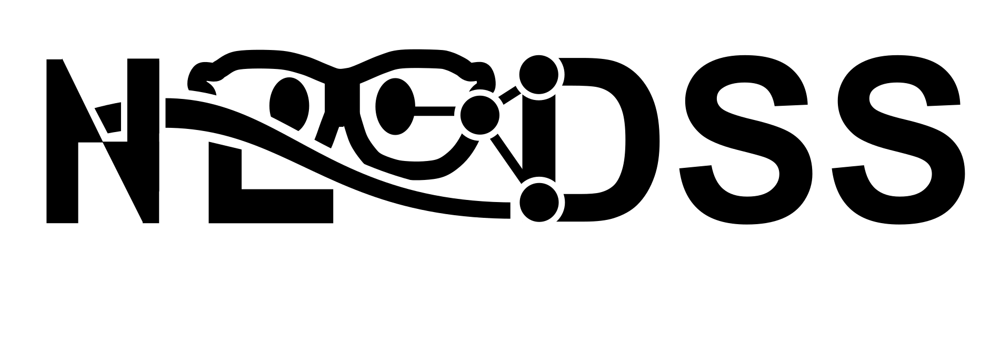

<p align="center">
  
</p>


## NERDSS Development

<p align="center">
  <!-- Release -->
  <a href="https://github.com/JohnsonBiophysicsLab/NERDSS/releases">
    
  </a>
  <!-- License -->
  <a href="https://github.com/JohnsonBiophysicsLab/NERDSS/blob/master/LICENSE">
    
  </a>
  <!-- C++ standard -->
  
  <!-- CMake minimum -->
  
  <!-- Package managers (optional) -->
  <!-- img alt="Conan" src="https://img.shields.io/badge/Conan-ready-0ea5e9">
  <!-- img alt="vcpkg" src="https://img.shields.io/badge/vcpkg-port-22c55e">
  <!-- Platforms -->
  
  <!-- Code style -->
  <!-- img alt="clang-format" src="https://img.shields.io/badge/clang--format-enforced-brightgreen"-->
</p>

Structure-Resolved Reaction-Diffusion Simulation Software by Johnson Lab, JHU

### Installation

---

#### Build Serial NERDSS

##### Step 1 — Install a C++ Compiler

###### macOS

Install Xcode via App Store. Alternatively, use commandline:

```bash
xcode-select --install
```

###### Ubuntu / Linux

```bash
sudo apt update
sudo apt install build-essential
```

---

##### Step 2 — Install GNU Scientific Library (GSL ≥ 1.0)

###### macOS (Homebrew)

```bash
brew install gsl
```

###### Ubuntu / Linux

```bash
sudo apt install libgsl-dev
```

---

##### Step 3 — Compile Serial Version

From the **NERDSS root directory**:

```bash
make serial
```

Executable will appear in:

```
./bin
```

---

#### Build Parallel NERDSS (MPI)

##### Step 1 — Switch to the MPI Branch

```bash
git checkout mpi
```

---

##### Step 2 — Install MPI (OpenMPI)

###### macOS (Homebrew)

```bash
brew install open-mpi
```

###### Ubuntu / Linux

```bash
sudo apt install openmpi-bin libopenmpi-dev
```

---

##### Step 3 — Compile MPI Version

From the **NERDSS root directory**:

```bash
make mpi
```

Executable will appear in:

```
./bin
```

---

##### Quick Verification

After building, check:

```bash
ls ./bin
```

You should see the compiled executable(s).

---

##### Summary

| Build Type | Command                         |
| ---------- | ------------------------------- |
| Serial     | `make serial`                   |
| MPI        | `git checkout mpi` → `make mpi` |

---


### Run Simulations

#### Run a quick trial with Google Colab

Click the following link to make a copy of the iPython notebook in your Google Colab and following the instructions on the Notebook (Note currently the link is under NERDSS development repo. The link will need to be updated once synced to released repo)

[](https://colab.research.google.com/github/mjohn218/nerdss_development/blob/master/docs/Run_NERDSS_colab.ipynb?copy=true)

#### Compile and run NERDSS on your local machine

1. Example input files are located in the subdirectories within the `sample_inputs` folder.

2. To start the serial simulation, use the command `./nerdss -f parms.inp`.

3. To start the parallel simulation, use the command `mpirun -np $nprocs  ./nerdss_mpi -f parms.inp`.

4. To debug the parallel code, use the command `mpirun -np 2 xterm -e gdb --ex 'b error' --ex r --args ./nerdss_mpi -f parms.inp -s 123`.

### Analyzing Results

1. Use the ioNERDSS PyPi library for visualizing simulation results.
2. Install ioNERDSS with *pip install ioNERDSS*.
3. Refer to the [ionerdss repository](https://github.com/JohnsonBiophysicsLab/ionerdss) for more details.

### Style Guides for Developers

1. We use the Google C++ Style Guide and the C++ Core Guidelines and prefer the C++ Standard Library and modern C++ features.
2. Provide comments and documentation to explain complex or non-obvious code sections. Write unit tests to ensure code quality.
