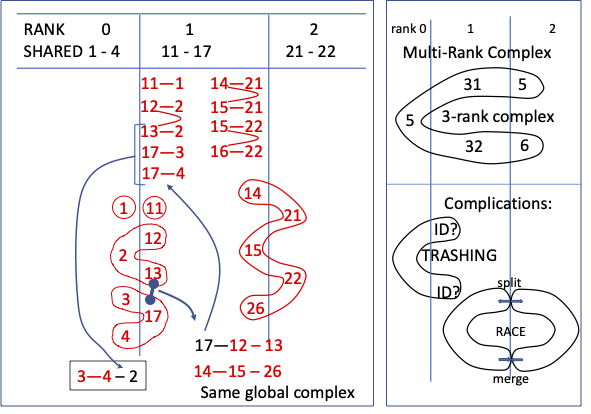
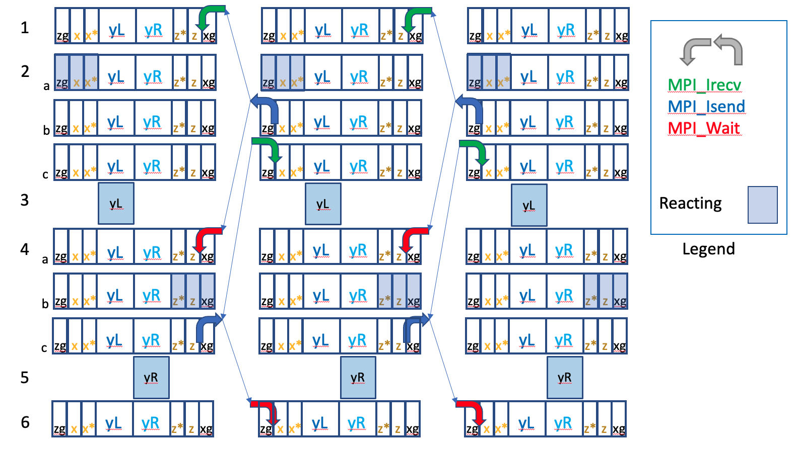

% NERDSS_Parallel_Developer_Guide

```
   \ /     \ /        Non-Equilibrium          \ /    \ /
  --O--   --O--      Reaction Diffusion       --O--  --O--
   / \     / \     Self-Assembly Simulator     / \    / \
```


**[1. Glossary](#heading--1)**

**[2. Abbreviations and Notation](#heading--2)**

**[3. Introduction](#heading--3)**

**[4. Basic Parallel Concepts](#heading--4)**

  * [4.1 Parallel Algorithm](#heading--4-1)
  * [4.2 Data Partitioning](#heading--4-2)
  * [4.3 Interactions through Ghosts](#heading--4-3)

**[5. Data Structures (for Serial NERDSS)](#heading--5)**

  * [5.1 Structure Coord](#heading--5-1)
  * [5.2 The Simulation Volume](#heading--5-2)
  * [5.3 Structure Dimensions](#heading--5-3)
  * [5.4 Molecule Template](#heading--5-4)
  * [5.5 Reactions](#heading--5-5)
  * [5.6 Structure Molecule](#heading--5-6)
  * [5.7 Structure Complex](#heading--5-7)

**[6. Data Structure Modifications and Functions for Parallel NERDSS](#heading--6)**

  * [6.1 Messaging Functions](#heading--6-1)
  * [6.2 Serializing and Deserializing Macros](#heading--6-2)
  * [6.3 Auxiliary Structures for Parallel Execution](#heading--6-3)
  * [6.4 General: Preparing Data Structures for Parallel Execution](#heading--6-4)
  * [6.5 Details: Preparing Data Structures for Parallel Execution](#heading--6-5)
  * [6.6 Receiving Prepared Data and Deserialization](#heading--6-6)

**[7. Simulation Parallelization](#heading--7)**

  * [7.1 Parallelization with MPI](#heading--7-1)
  * [7.2 Communication Between Ranks](#heading--7-2)
  * [7.3 Overview: Actions of Complexes, Molecules, and Interfaces that must be coordinated across processes](#heading--7.3)

**[8. Complex Management](#heading--8)**

  * [8.1 Complexes Spanning Multiple Ranks](#heading--8-1)
  * [8.2 Molecule Association with Multi-rank Complexes](#heading--8-2)
  * [8.3 Connections in Complexes](#heading--8-3)
  * [8.4 Communication Protocol](#heading--8-4)
  * [8.5 Synchronization and Action Details between Ranks](#heading--8-5)
  * [8.6 Complex Fracturing and Splitting (within in a single iteration)](#heading--8-6)

**[9. Fully Parallel (Concurrent) Computing Model](#heading--9)**

  * [9.1 Zoning for Full Concurrency](#heading--9-1)
  * [9.2 Updating Zones, and Zone Communication Patterns](#heading--9-2)
  * [9.3 Simulation Model](#heading--9-3)

**[10. Debugging Parallel Execution](#heading--10)**

**[11. Debugging Support Macros and Functions](#heading--11)**

**[12 Appendix](#heading--12-APP)**

  * [A Parallel Run Script, `prun.sh`](#heading--12-A)
  * [B Fully Parallel Communication Model Testing](#heading--12-B)
  * [C Instructions for Creating HTML and PDF Documents](#heading--12-C)


<div id="heading--1"/>
# 1. Glossary

-- **MPI Terms**

> **rank** - Processing unit. A parallel execution consists of multiple MPI ranks
executing as multiple processes. Generally the number of ranks specified is no
larger than the number of cores.

> **Non-blocking send/receive** - Asynchronous send/receive, i.e. sending/receiving in background during the processing.

-- **Zone Terms**

> **x-bin** - Cells/SubVolumes are represented by an integer triplet {i,j,k}, in x, y and z directions.
            x-bin is the "i" value (in the x direction) for the cell.
            [Each cell is numbered i+j*N+k*N*N, where N is the number of cells in a direction (Nx=Ny=Nz=N).]
            
> **Zone** - specified as an x-bin number, but representing all cells within the triplet {x-bin,#,#}.

> **Ghost Zone** - Zone copied to a rank for accessing a neighbor's data during the rank's processing.

> **Rank-owned Zones** - Zones assigned to a rank for processing. This does not include ghost zones.

> **Border Zone** - Rank-owned zone next to the ghost zone.

> **Shared Zones** - Border zone + ghost zone pair. Note that a rank in general has both left and right shared zones.

-- **Complex Terms**

> **multi-rank complex** - A complex spread over multiple ranks ("shared complex" in code comments)

> **complex portion** - The part of a multi-rank complex (molecules and interfaces) belonging to a rank 

> **holder rank** - A rank that has a complex portion

> **owner rank** - Designated holder rank that makes the decisions for multi-rank complex action requests

> **complex merge** - Association (connection) of two unconnected complexes into a single complex.

> **complex split** - Split up (disconnection) of a multi-rank complex into two unconnected complexes.

<div id="heading--2"/>
# 2. Abbreviations and Notation

> **IL**  - (Implicit Lipid)

> **com or c** - (complex)

> **mol or m** - (molecule)

> **ifc** - (interface)

> **mem** - (member)

> **S**   - (Serial) means value is from input file parsed as serial input --
          the initial complexList, moleculeList etc. contain "serial-specific" values

> **R**   - (Rank)   means value is prepared for a rank -- after partitioning the serial complexList,
          moleculeList etc. will have partitioned, "rank-specific" values.

> **i**   - Iterator, usually  abbreviated identifiers (molecule | complex | ifc) and (Serial | Rank) , e.g. i_mol_S iterator

_______________

>**Notation:  The memberList, complexList, or moleculeList code object name may also be read as member list, complex list, or molecule list".**

_______________

<div id="heading--3"/>
# 3. Introduction

This documents is for any developer interested in parallel execution of the NERDSS simulator.

The main loop of the simulator iterates over time steps, repeating the
same operations:

- PRB - Selects by PRoBability "unimolecular" Species from pool for creation, destruction and dissociation.
- SEP - Measures SEParation between molecules to identify Reactions.
- RXN - Forms REACtioN bonds of an allowed bimolecular associations, moves non-reacted molecules.
- OVR - Avoids overlapping of molecules/complexes.

The code for these operations can be executed, "as is", in either in parallel or serial mode.
Due to the complexity of the NERDSS algorithm, the "MPI" version reuses all of the original serial code,
with minimal changes for parallel mode. Effectively, the serial code 
for the operations have become execution kernels for each rank's set of molecules.
One can think of the parallelism as each rank (process) executing instructions
almost as if it were a single (serial) NERDSS run on the system.

The preservation of serial code means that each rank must number (and track)
its partition of molecules (and complexes) locally from a "fresh" base of numbers
(as if its molecules were entered from input as a separate serial run). So, each rank
will begin execution on as set of molecules (and complexes) with numbers {0, 1, 2,...}.
The number is a local **index** that identifies the molecule (and complex) of a rank.
A corresponding **id** is used to map between the local index and an assigned global
id which is a unique number across all ranks. The id is used for tracking movement across ranks.

Variables and structures have been added where necessary, and additional functions inserted
to accommodate molecule partitioning and coordinating among the MPI ranks. In particular,
generic packing/unpacking functions (named as serialization/deserialization functions in the code)
are the primary mechanism for preparing data to be shared with other ranks. (Since NERDSS
uses its own functions for packing/unpacking data, the more complicated and expensive packing with 
MPI Derived Datatypes is avoided.)

It is important to understand that input is first parsed as though a serial (S) run is to be executed.
The usual serial structures (e.g. for moleculeList and complexList here) ALL have unique complexes and
molecules, as well as their indices. A text reference to list item (whether structure or index)
will often be specified as "serial-specific" and code references will be suffixed with an "_S" 
(as in `i_com_S` for the complex iterator of complexList).

In the partitioning process, lists holding the partitioned structures are appended with "Rank" 
in the code (e.g. moleculeListRank and complexListRank).
A text reference will often described as "rank-specific" and text references to the iterator are often
specified with an appended "_R" (as in `i_com_R` for the complex iterator of complexListRank).

After the input has been partitioned for the ranks (by rank 0), it is broadcast to each rank, and effectively
the serial lists and structures are overwritten with the corresponding rank-specific (parallel) versions.
That is the "old" serial lists and structures become the "new" parallel lists and structures.

The following chapters provide useful descriptions of concepts, organizational components,
structures, and operations for understanding the parallelization.
First, the Parallel Algorithm and Data Partitioning are covered in the **Basic Parallel Concepts** chapter.
This is followed by two chapters that describe key serial-code Data Structures,
and their adaptation for parallel execution 
(**Data Structures** and **Data Structure Modifications and Functions for Parallel NERDSS**).
Next, the integration of the communications layer (operations) between ranks is 
described for single- and bi-molecule complexes in the **Simulation Parallelization** with MPI chapter. 
Additional text is devoted to managing larger complexes in the **Complex Management** chapter.
Also in this chapter, "Action" Messaging for multi-molecule complexes is introduced. 
This communication paradigm aggregates action requests on a rank and 
broadcasts them to ranks that need to take actions on complexes (and respond).

This is followed by the communications algorithm for a fully concurrent computing model for NERDS
in the **Communication Patterns, Fully Concurrent (FC) Parallel Computing Model** chapter.
The document ends with two chapters on debugging, **Debugging Parallel Execution** and 
**Debugging Support Macros and Functions**. These chapters present the tools any parallel
developer will need in the daunting task of debugging NERDSS (any) parallel code.
The Appendix presents a script for running (and debugging) the (even-odd) parallel NERDSS.
It also presents a prototype implementation for the Full Concurrent (FC) model communication,
and describes how to compile and execute the code, `FC_Communications.cpp`.


<div id="heading--4"/>
# 4. Basic Parallel Concepts

<div id="heading--4-1"/>
## 4.1 Parallel Algorithm

The parallelization of the NERDSS algorithm is accomplished by partitioning 
molecules among processes and communicating between processes through MPI (Message 
Passing Interface).

In order to make the system scalable,
each rank performs as much work independently as possible,
and minimizes (point-to-point and collective) communications.
Additionally, non-blocking (asynchronous) communications have been implemented (where reasonable).
The latter allows each rank to work on its portion of data,
while communicating with neighboring ranks for updating data shared by neighboring ranks. 

Molecules are a basic unit for evolving the simulation since they consist
of a Center of Mass (CoM) with rigid attachment points (interfaces).
However, molecules interact through interfaces which have reaction properties 
(capabilities), and may have prescribed states.
When molecules are connected (bonded) through interfaces,
the properties of the "aggregate" is represented as a single complex.
These three components are illustrated below.


```
      3 Molecules            O     O     O    
 
 
                            \ /    |    \ /  
     12 Interfaces           O-- --O-- --O
                            /      |      \    

      
      1 Complex              O-----O-----O
 
 
 
```
> Figure 1. Three molecules (top), each with 4 interfaces(middle),
             appearing as a 3-molecule complex (bottom) connected through interfaces.

In serial (shared-memory) executions,
looping over molecular pairs for possible interactions between interfaces and attachment
to a complex is trivial. In parallel execution mode, each rank
loops over possible molecular-pair interactions of molecules (it "owns"), using local molecular
and complex indexes and the serial functions (kernels). There are complications, though:

   1.) The location of molecules in a complex may span across ranks.
       (Processing of a multi-rank  complex can be assigned to the rank's "complex owner", the rank
       where the complex CoM (Cntr. of Mass) is located.) Bimolecular complex processing
       is easily handled with "border zone" interaction processing-- which involves
       sharing data of molecular reaction size border zones of the 
       parallel-partitioned simulation volume.  Processing complexes larger than 
       bi-molecule may involve processing beyond the border zones, and require 
       Complex Management to coordinate additional communication.)
        
   2.) The distance between molecule A owned by rank j may be close enough to 
       molecule B owned by adjacent rank k to react. 
       (Data for a zone containing molecule A of rank j, and a zone containing
       molecule B of rank k are shared. Hence, the proximal distances can be observed; 
       and the pair considered for interaction by only one rank.)

   3.) At the finest granularity, one of a molecule's interface locations may be in 
       one rank, with the molecule's Center of Mass (COM) in another rank. (Processing
       occurs by the rank "owner", the rank where the molecule's CoM is located.)

The primary purpose of MPI communication is to update shared data of the border zones 
for all types of reactions that don't involve complexes larger than two molecules. Otherwise,
Complex Management is employed which involves more than just updating shared data.

<div id="heading--4-2"/>
## 4.2 Data Partitioning

In the serial code the iterations over the complete NxN/2 space of pairwise molecules
interactions is avoided by subdividing the whole volume and evaluating interactions 
within a unit and its neighbors.

The simulation volume is divided into cubes called cells (or subvolumes).
This same division is used for partitioning molecules among ranks (processes).
The cells are indexed as in a 3-D matrix as 3-tuples {x,y,z}, with the x-dimension
indexed first. With the knowledge of the bounds for 
each cell, molecules are binned into the cells which contain lists of member molecules.

The division in the x-direction is used for partitioning molecules among ranks (processes).
All cells having an x index of 1 are said to be in ```xbin``` 1, or ```zone``` 1 
(i.e. all cells with {1,y,z}).
A sequential set of xbins is assigned to a rank. ```xbin``` is the name (and variable)
used for holding the x index in the code. However, ```zone``` is used 
to denote the index (simply as the "zone number"), and to indicate ALL the cells 
associated with the index (all cells of {xbin,y,z}).

That is, the zones are partitioned among the ranks, and a rank will "own" (partitioned) zones.

Figure 2 illustrates the shorthand notation used to describe the zones of a rank.
It shows the notation for ranks 2 and 3 of a 28-zone simulation with 4 ranks, 
where the partitions for ranks 0-3 are {0-6}, {7-13}, {14-20}, {21-27}.
The **first line** shows the sequence of the zone indices of the ranks, and the use 
of enclosing bars (| |) to indicate the border zones.
We define the first and last index of a sequence as border zones -- indicating
that the preceding or next zone (xbin) number, respectively, is owned by a neighboring rank.
(A neighboring rank is an adjacent rank with a rank number differing by 1.)

Because a molecule in a border zone can possibly interact with a molecule
in a border zone of an neighboring rank, it is necessary that each rank have 
a copy of the border zones of its neighboring ranks.
A copy of the neighboring-rank border zone is called a ```ghosted``` zone. 
(That is, a ghosted zone is a border zone from an neighboring rank.)
The **second line** in Figure 2 shows the ghosted zones (numbers) in the zone list for the rank.
Note that ranks 2 and 3 BOTH have data for zones 21 and 22 (as |21|22|).
These pairs are called shared zones, because the same data appears on two 
different ranks-- it is shared.
While the data storage is symmetric (same data on both ranks), there use is not-- 
otherwise possible reaction pairs of interactions would be found on each rank
and doubly processed.
A molecule that exists in a ghosted zone is marked as ``isGhosted``.
It is important to note that a molecule that has a ghosted state on one
rank, is not ghosted on its corresponding neighboring rank.
The "is Ghosted" character is checked in the reaction selection logic to avoid 
double counting/processing (details explained later).

The **third line** shows the asymmetry by depicting the data usage in shared zones
as either a border zone (b) or a ghosted zone (g).
The other zones owned by the rank are labeled as interior (i). 

The **fourth line** (final zone list) in Figure 2 shows the local zone numbers used by each rank. 
(An ```xoffset``` for each rank is used in the code to convert between global and local zone values.)

```
         Partition Model (7-zone partitions, along X-dimension, for ranks 2 and 3)
         
            rank 2                              rank 3 
     |14| 15 16 17 18 19 |20|          |21| 22 23 24 25 26 |27|     Global zones  | |==border zone
  |13|14| 15 16 17 18 19 |20|21|    |20|21| 22 23 24 25 26 |27|28|  Global zones + Ghosted zones
  | g| b|  i  i  i  i  i | b|g |    | g| b|  i  i  i  i  i | b|g |  ghosted(g),border(b),internal(i)

  | 0| 1|  2  3  4  5  6 | 7| 8|    | 0| 1|  2  3  4  5  6 | 7| 8|  Local zone (xbin) numbers of rank

 [shared]                [shared]  [shared]                [shared]   Sharedness
     [      rank owned      ]          [      rank owned      ]       Ownership
```
> Figure 2. 7-zone partitioning for ranks 2 and 3: owned zones (1st number list), 
          owned + ghosted zones (2nd list), border(b)/ghosted(g) designation (3rd list),
          and local zone (xbin) numbering (4th list) .


<div id="heading--4-3"/>
## 4.3 Interactions through Ghosts

By partitioning zones among the ranks and using local indexes each rank acts like an independent
ensemble of particles. By including ghosted zones, interactions across rank borders can occur, 
thereby forming a single system, at the cost of synchronizing border interactions (first the
shared zones on one rank and then the shared zones on neighboring rank after an update).

Cells store a neighbor list in a `simulVolume` structure, i.e. indices of neighboring cells. These lists are created
for the whole simulation volume at the beginning for both serial (and parallel execution).
Pair-wise interactions are determined for inter-cell interactions, and then for interactions
between its neighbors. The neighbor list is actually a subset of neighbors such that the 2-loop iteration
over all the cells (outer loop) and their neighbors (inner loop over neighbor list) considers each cell pair just one.
(Hence, if cell number 1 has 2 as one of its neighbors, cell 2 will not have cell 1 in its neighbor list.)

By preserving the neighbor list during the partition, double counting/processing is avoided.
(See shared zone in Figure 2.)
However, the introduction of ghosted zones re-introduces double counting/processing, but
ghosted molecules are avoided in this processing.

Figure 3a illustrates the serial-specific x-indexing (see i_S) in `simulVolume` (`xIndex`), and 
the rank-specific x-indexing (see i_R) in `simulVolumeRank`. Also, the total number of cells for the rank, 
`numSubCells.tot`, is updated in `SimulVolumeRank`.

```  
          <rank0>       <rank1>        <rank2>
    i_S   0 1 2 3 4   3 4 5 6 7 8    7 8 9 10 11   <- simulVolume.subCellList[i].xIndex
                  ^   ^         ^    ^        ^    ^ == ghost
    i_R   0 1 2 3 4   0 1 2 3 4 5    0 1 2  3 4    Rank index: simulVolumeRank[i]
                     /  / | | \  \ 
                    /  /  | |  \  \ 
                   /  /   | |   \  \
                  /  /    | |    \  \ 
                 /  /    /  \     \  \ 
                /  |    |    |    |   \    
               1  0,2  1,3  2,4  3,5  4            New neighborList for simulVolumRank[i]
```

> Figure 3a. serial- and rank-specific x-indexing mapping between simulVolume and simulVolumeRank structures,
and rank-specific neighbor list.


&nbsp; **Ghost Details and Even-Odd Execution/Communication Model**

In the parallel execution mode, interactions are allowed across ranks. Hence a border zone need only 
have a width of Rmax (in the x direction) to minimize communications and to accommodate a reaction 
between molecules across ranks.

The cubic cell restriction can be lifted to allow border zones to be slivers of Rmax x-direction width. 
Zones are discussed in an abstract sense, denoting the two sliver borders (zones) as "x" and "z"
and the multiple zones in the interior as "y", as show in Figure 3b. 
(A "g" suffix is used to indicate a ghosted zone.)

Ghost zones could be affected by the rank, but changes must be propagated to neighboring ranks.
While the rank is executing the code that may modify these zones,
neighboring ranks must not access any of molecules within these zones.

Interaction between molecules of different ranks is accomplished with ghosted zones.
The first version of the parallel paradigm implements a simple 2-step sequence
to ensure interactions affecting a ghosted molecule on one rank are updated on an
its non-ghosted molecule in a neighboring rank. This is accomplished by these operations for each iteration:

 - allowing only the even ranks to execute the simulation
 - sending all border zone data on the even ranks to the odd ranks (updating the odd-rank border data).
 - allowing only the odd ranks to execute the simulation
 - sending all border zone data on the odd ranks to the even ranks (updating the even-rank border data).

```
     |    rank i-1    |    |    rank i      |  |    rank i+1    |  |    rank i+2    |
     |zg| x| y |z |xg |    |zg| x| y |z |xg |  |zg| x| y |z |xg |  |zg| x| y |z |xg |
```
> Figure 3b. Abstract XYZ notation of ghosted(g)/non-ghosted border zones, and interior
          area  (cf Figure 2.). Execution alternates between even and odd ranks.

Modifying the xg zone also affects the y zone.
In order to be able to perform reactions in zones x, y, and z independently,
and to cover communication cost with computation,
each y zones can be divided as shown in the following figure (for the fully concurrent model,
not used in Even-Odd concurrent model).

```
    |      y zone       |
    |x*|  yL  |  yR  |z*|
```
> Figure 3c. Additional star (*) zone (size RMAX) for fully concurrent model. 

The following Sections describe the NERDSS simulator with a focus on tracking molecules over ranks.

<div id="heading--5"/>
# 5. Data Structures (for Serial NERDSS)

There are only a few structures that are important for the parallel implementation.
These structures are reviewed to provide a solid basis for understanding the use
of their members (variables, vectors, lists, etc.) in the parallel NERDSS version, 
and to comprehend where and why additional members and function are included for 
parallel execution. Definitions and roles of new members in these structures are
presented.

<div id="heading--5-1"/>
## 5.1 Structure Coord

The `Coord` structure (`struct Coord)` is used for storing 3-D coordinates.
Each coordinate (`x`, `y`, and `z`) is represented as a double.

<div id="heading--5-2"/>
## 5.2 The Simulation Volume

The `SimulVolume` structure is the source of simulation volume information.
The `SubVolume` structure, contained within the `SimulVolume` structure
contains information about the "cells" of the partitioned volume:

- `xIndex`, `yIndex` and `zIndex`, cell dimensional indices ({x,y,z} tuple)
- `absIndex`, flattened dimensional index { = `xIndex` + `yIndex`*Nx + `zIndex`*Nx*Ny }; Where Nx=Ny=Nz
- `memberMolList`, a list of indices of molecules within a cell.
- `neighborList`, a list of neighbor cells indices (neighbor sublist supports unique pairing).

A list of these cell structures is maintained in the `SubVolume` structure as the `subCellList`
list (```vector<SubVolume> subCellList```)-- a somewhat convoluted name.
Within the code comments, "subvolume", "subcell" and "cell" are used interchangeably.

<div id="heading--5-3"/>
## 5.3 Structure Dimensions

Another structure defined in `SimulVolume` is the `Dimensions` structure.
Its `x`, `y`, and `y` int members contain the number of cells (subvolumed) in each direction,
and `tot`, the total number of sub-volumes. (It is mentioned here only for completeness.)

<div id="heading--5-4"/>
## 5.4 Molecule Template

The properties of each type of molecule are contained in a 
molecule template structure, `MolTemplate`, and each molecule
has an index (`molTypeIndex`) that references its molecule type.

The `MolTemplate` structure also contains `interfaceList`, a list of `Interface`
structures that have information about the type's interfaces for binding. 
This `Interface` is different
from another interface structure, `Iface`, that EACH molecules contains.
(The molecule's `Iface` structure contains mutable information: coordinates, state, etc.)
The `Interface` structure contains information of a MolTemplate's interfaces.
Non-mutable state information for each interface is contained in a `State` structure.
(e.g. Iface participates in: myForwardRxns, myCreateDestructRxns, rxnPartners or stateChangeRxns.)
If an interface is associated with a state, then a reaction involving that interface
will depend upon the state.
(e.g. phosphorylated proteins participates in a different set of binding events
than unphosphorylated proteins).

A molecule template is often referenced for properties of a molecule and
its interfaces.  An important property involved in parallel updates
is the `monomerList` which lists molecule indices for monomers.

<div id="heading--5-5"/>
## 5.5 Reactions

Reactions (forward, backward, and create/destruct) determine which interface can 
participate in bi-molecular association/dissociation and unimolecular create/destroy activity,
possibly depending on the state (of an interface).

Reactions can have a forward only direction (->), or forward and backward directions (<->)
The types of reactions are:

- bimolecular Rxn [association/dissociation]
- biMolStateChange [X(state1) + Y -> X(state2) + Y]
- uniMolStateChange [unimolecular state change reaction (X <-> X*)]
- zerothOrderCreation [creation reaction from concentration (0 -> X)]
- destruction [destroys entire molecule/complex, not just interface]
- uniMolCreation [creation reaction from Molecule (X -> X + Y)]
- bindToSurface

<div id="heading--5-6"/>
## 5.6 Structure Molecule

Structure `Molecule` is the most important structure in NERDSS.
It is the container for molecule AND interface information.
A list of all molecules (structures) is maintained in ``main`` as `vector<Molecule> moleculeList`.
A molecule is identified by its *index* (position) in this vector. This index
is stored as a member in the `Molecule` structure.

For parallel execution the most important fields are:

- `index` - vector position of this molecule in moleculeList
- `partnerIndex` - bound partner index in molecule list
- `partnerIfaceIndex` - interface index of the Molecule's partner.
- `interaction` - a structure holding data related to the interaction,
                  including partner index, and interface index.
- `comCoord` - center of mass coordinate of a molecule
- `isEmpty` - if true, the molecule has been destroyed and is void
- `numberOfMolecules` - counter for the number of molecules in the system.
                        This field is static, i.e. there is only one value for all molecules.
- `emptyMolList` - list of indices to empty Molecules in `moleculeList`

&nbsp; **Iface**

`Molecule` also contains the `interfaceList` vector of `Iface` structures.
These interfaces contain mutable information such as 
absolute interface coordinates (`coord`), the current chemical
state (`stateIndex`), boundness (`isbound`), etc. and
bonding information to other molecules with which it forms a (multi-molecule) complex.

&nbsp; **Interaction**

It is the `Interaction` structure in each `Iface` member
that contains the molecule index for the "interaction" partner of
the interface. 

- `partnerIndex` - bound partner molecule index
- `parnerIfaceIndex` - interface index of partner
- `conjBackRxn` - back reaction for the interaction

<div id="heading--5-7"/>
## 5.7 Structure Complex

Initially (in the beginning of a simulation), every molecule is a complex.
Hence, initially every molecule has its own `Complex`
structure (coincidentally and initially the index for the molecule and complex are the same).
Just like `moleculeList`, a list of all Complex (structures) is maintained in 
``main`` as `vector<Complex> complexList`. 
The `myComIndex` variable in the molecule structure is the index (position) 
in `complexList` of its associated complex. This index is also stored in an `Index` variable
of the `Complex` structure.

When a bond forms, one of the complex structures of the molecule becomes the
complex (the other complex is marked `isEmpty`).

The following fields are important because they are accessed in the parallel implementation code:

- `index` - index of this complex in `complexList`.
- `memberList` - list of complex member molecules (indices).
- `isEmpty` - true if the complex is not in use any more (is a void, waiting to be destroyed)
- `numberOfComplexes` - total number of complexes in the system.
  This field is static, i.e. there is only one value for all complexes.
- `comCoord` - complex's center of mass coordinate.


<div id="heading--6"/>
# 6. Data Structure Modifications and Functions for Parallel NERDSS

<div id="heading--6-1"/>
## 6.1 Messaging Functions

Distributing the initial data among ranks and updating between ranks is
performed by MPI messaging. Packing and unpacking the data for communication
is performed by serialization and deserialization routines, respectively.
Due to the large number of disparate and nested structures, the use of
MPI derived types (containers with descriptive formatting) was considered an unnecessary complication.
Serialization of an object converts the data that the object holds
into a single array of raw bytes, so that it can be transferred over the network
in a single MPI transfer (or placed in a binary file with a single write statement for checkpointing).
It also allows for picking the fields that need to be transferred, avoiding non-mutable ones.
Deserialization is the opposite process. It restores objects from the raw data
received through the network (or from a file for checkpointing). Since serialization and deserialization is
a "bitwise" copy procedure, structures with substructures must be mined recursive.
That is, objects contained in an object are serialized (and deserialized) separately.
APIs functions exist for each type of structure, and includes templated forms for list, maps, etc.
This "component" approach makes it easy to add a new structure and lists, and their APIs,
for the de/serialization process.
Base types are serialized and deserialized using macros that need no modification.

The serialized (packed) data are stored in an array of bytes, `arrayRank`,
and sent as a single object to another rank.
(The suffix `Rank` in variable names denotes it is for another rank).
The following code illustrates how a primitive variable type, here the _double_ `x`, 
is stored in `arrayRank`, starting from byte zero.

The storage address of `arrayRank` is determined by `&(arrayRank[0])`.
This pointer is cast into the pointer for type _double_
by `double *` and finally the value of `x` is stored in the first eight bytes of `arrayRank`
by `*(...) = x`.

```C++
		*( (double *) &(arrayRank[0]) ) = x;
```

The next object is stored in `arrayRank` at the next empty byte. In this case, the next free 
position in the array is after the `double`, or `sizeof(double)` bytes relative to
the base address:
```C++
		*( (double *) &(arrayRank[sizeof(double)]) ) = y;
```
More practically, the next free location is maintained in an integer `nArrayRank` variable, 
which is updated after each new object is serialized, as shown here for `y`:
```C++
		*( (double *) &(arrayRank[nArrayRank]) ) = y;
		nArrayRank += sizeof(double);
```
At the end of the serialization process, the size of the array `arrayRank`
that needs to be sent to another rank is `nArrayRank`. (Often the first entry
is size information.)

Deserialization is the opposite of serialization.
The location of the value for variable `y` is `arrayRank[nArrayRank]`,
where `nArrayRank` is updated to the next un-deserialized storage location right after.
To extract the correct size and type from that position for
the assignment into y, the address at a position is determined by
`&(arrayRank[nArrayRank])`, and then the address is cast into a double pointer, `(double *)`.
Finally, this "pointer" (lvalue) is dereferenced, `*(...)` as shown below for `y`.
This deserialization method is shown in the following source code:
```C++
		y = *( (double *) &(arrayRank[nArrayRank]) );
		nArrayRank += sizeof(double);
```
To summarize the above examples, variables of type _double_ are serialized to, and deserialized
from, an array. Initially, `nArrayRank` is set to 0.
After all the objects have been serialized or deserialized, `nArrayRank` contains 
the total occupied storage size.

The process can be easily implemented for any base type using a template.
Building on the base variable serialization presented above,
functions for serializing STL sequential containers (vectors, lists, maps, matrices, etc.)
and structures are created with a generic type declaration:

```C++
	template <typename T>
```
where a function argument is typed generically with the template parameter, `T`
(generic type or template parameter) for function arguments and variables,
as shown here for typeing a vector:

```C++
	std::vector<T> to_serialize;
```
This enables a single definition of functions for various lists of base types.

For example, the template function `serialize_primitive_vector` is declared as:
```C++
	template <typename T>
	void serialize_primitive_vector(std::vector<T> to_serialize, \
	                                unsigned char *arrayRank, int &nArrayRank);
```
where `arrayRank` and `nArrayRank` are storage variable arguments required for serialization,
as already explained.

The function call for a vector of type _int_ containing integer molecular indices (`emptyMolList`) 
becomes:

```C++
	serialize_primitive_vector<int>(emptyMolList, arrayRank, nArrayRank);
```
Analogously, the template function `deserialize_primitive_vector` is declared as:

```C++
	template <typename T>
	void deserialize_primitive_vector(std::vector<T> &to_deserialize, \
	                                  unsigned char *arrayRank, int &nArrayRank);
```
and the symmetrically looking deserialization function call is also easy to write and read:
```C++
	deserialize_primitive_vector<int>(emptyMolList, arrayRank, nArrayRank);
```
(Compared to the typical function call, this function template call has an `<int>` added between the function name
and the argument list which instructs the compiler to create (instantiate) a function based on the template
for a given type (`int`).

Developers who introduce a new member in a class/structure that needs to be exchanged between ranks,
should insert a serialization and a deserialize function call (of appropriate type) for the member 
if its class/structure includes serialization/deserialization methods for exchanging data.

Functions for serializing and deserializing a matrix container are:

```C++
	template <typename T>
	void serialize_primitive_matrix(std::vector< std::vector<T> > to_serialize, \
	                                unsigned char *arrayRank, int &nArrayRank);
```
and

```C++
	template <typename T>
	void deserialize_primitive_matrix(std::vector< std::vector<T> > &to_deserialize, \
	                                  unsigned char *arrayRank, int &nArrayRank);
```

Containers that require a size type, can be accommodated by a slight modification 
to the above functions, as for this vector-of-arrays serialization:

```C++
	template <typename T, std::size_t S>
	void serialize_vector_array(std::vector< std::array<int, S> > to_serialize, \
	                            unsigned char *arrayRank, int &nArrayRank);
```
where S is substituted with an _constant int_, as in:
```C++
	serialize_vector_array<int, 3>(crossrxn, arrayRank, nArrayRank);
```
Matrices are serialized and deserialized using the following template functions:

```C++
	template <typename T>
	void serialize_abstract_matrix(std::vector< std::vector<T> > to_serialize, 
	                               unsigned char *arrayRank, int &nArrayRank);
```
and

```C++
	template <typename T>
	void deserialize_abstract_matrix(std::vector< std::vector<T> > &to_deserialize, \
	                                 unsigned char *arrayRank, int &nArrayRank);
```
If one needs a custom serialization function,
the implemented template functions should be examined first.
If a new function needs to be implemented,
please follow the naming conventions of the implemented template functions.

Tests have been constructed to check whether serialization and 
deserialization work as planned. (See code in `src/debug/debug.cpp`.).
These are identified with the `test_` prefix, as show below.
As a best practice, new functions should be evaluated with a similar test function.

```C++
	template <typename T>
	bool test_object_serialization(T to_test, \
	                               unsigned char *array1, bool verbose = false);
```
and
```C++
	template <typename T>
	bool test_abstract_vector_serialization(std::vector<T> to_test, \
	                                        unsigned char *array1, bool verbose = false);
```
Each test serializes an object or a vector, then deserializes it, and finally 
re-serializes it again. The data of the two serializations are compared, and a true
value is returned if and only if they are identical. Implementation details of these test
functions are not discussed here.

<div id="heading--6-2"/>
## 6.2 Serializing and Deserializing Macros

In the previous section, the serializing/deserializing functions were described
by their basic operation:  packing data into an array of bytes, `arrayRank`,
and recording the total number of occupied bytes of the array in `nArrayRank`.
We illustrate the serialization operation, again, for an integer (x):

```C++
	*( (int *) &(arrayRank[nArrayRank]) ) = x;
	nArrayRank += sizeof(int);
```
The complicated syntax of the first statement hides the simplicity of the 
bit-wise copy operation and even masks what is happening if one is
not familiar with casting variables into different types.
Macros are introduced to regain simplicity and readability of the code.

The simple, single-argument **PUSH(variable)** macro is used 
to specify the serialization of a primitive type (`variable`) to serialize:
The macro is general in that it works with all primitive types.

The two serialization statements discussed above
(the copy `variable` into the `arrayRank` array of chars, starting from 
`nArrayRank` bytes, followed by increasing `nArrayRank` by the number of serialized bytes),
can be replaced by a macro call. The macro uses (`__typeof__`)
for the compiler to discover the type and size of the argument.

The following code is the **PUSH(variable)** macro: 

```C++
	#define PUSH(variable) \
	    *( (__typeof__ (variable) *) (arrayRank + nArrayRank) ) = variable; \
	    nArrayRank += sizeof(variable);
```
where `arrayRank` and `nArrayRank` are assumed to be in scope, and
the type and size of the primitive type argument are extracted from the variable 
itself (`variable`) with the `__type__` and `sizeof` operators.

Similarly, deserializing from the `arrayRank` array of chars
into the variable `variable` for any of the primitive types
starts from the `nArrayRank`-th byte of `arrayRank`.
It is followed with an increase of `nArrayRank` by the size of variable `variable` in bytes.

The **POP(variable)** macro is:

```C++
	#define POP(variable) \
	    toSerialize = *( (__typeof__ (variable) *) (arrayRank + nArrayRank) ); \
	    nArrayRank += sizeof(variable);
```
The following code uses `PUSH` and `POP` to serialize and deseriale 
primitive type variables (and expressions):

```C++
	int a;
	PUSH(a);
	...
	int b;
	POP(b);

        // and for an expression
	PUSH(15+4);
```

A more robust PUSH/PULL is needed to accommodate communication to multiple ranks
when Complex Management is used in the simulation.
Sending and receiving data related to management of complexes differs from 
nearest-neighbor communication.
Any rank can be the "owner" of a complex and may need to communicate with all
other ranks that have molecules which are a part of the complex.
Using a single array of bytes (`arrayRank`) for Complex management would impose 
an immediate processing demand of the data (sent to or receive from a particular rank).
Allowing multiple asynchronous sends and receives to be outstanding is a
more efficient was to handle this type of multi-rank communications. This also requires
multiple sending and receiving buffers. (Initially, the NERDSS nearest-neighbor communication buffer
(`arrayRank`) has a fixed size and is set large enough to handle any number of molecule
and Complexes in a rank. A flexible adjustment of the buffer size is evaluated after each 
simulation step, though.)

Reserving a static amount of memory for each rank (in Complex management) 
to accommodate enough of the communication data in the worst-case scenario 
is error-prone, memory-demanding, and not scalable.
Our solution is to use a vector (with dynamic size adjustment) for each 
rank's buffer, and to contain these buffers in a vector of rank buffers
(for an adjustable number of ranks as members of a complex).
A vector of vectors (of type bytes), called `toRank`, is used for this purpose.
Similarly, each rank (involved in the complexes) is assigned a separate vector of bytes
for receiving data from other ranks. This vector of vectors is appropriately named `fromRank`.

To accommodate the `toRank` vector of vectors in serialization,
as well as to enable chosing where to send data to,
it was necessary to create a separate macro, `PUSH_TO(variable, iRank)`.
All primitive types and expressions evaluated at run time are supported.
The following statements implement the **PUSH_TO(variable, iRank)** macro.

```C++
	#define PUSH_TO(variable, iRank) \
	{ \
	    __typeof__ (variable) var = variable; \
	    int nBytes = sizeof(var); \
	    for(int nChr = 0; nChr < nBytes; nChr++) \
	        mpiContext.toRank[iRank].push_back( ((unsigned char *) &var) [nChr]); \
	}
```
where `iRank` is the rank the data will be sent to.
The macro replacement code assigns the `variable` variable (or expression) into a 
new variable, `var`, and determines its size. Then, a loop copies it, byte by byte, 
into the `toRank[iRank]` vector. A similar **POP_TO(variable, iRank)** macro
exists for deserialization.

<div id="heading--6-3"/>
## 6.3 Auxiliary Structures for Parallel Execution

One of the main design features of the parallel implementation
was to maintain a single source for the serial and parallel versions of the simulator.
Additional data storage required for parallel MPI communication buffers, metadata
and global lists are maintained in separate structures.

&nbsp; **MpiContext**

The `MpiContext` structure is a container for most of the data related to parallel
execution. This is the only parallel structure passed "around" as a single, end argument 
to many functions.

A single parallel container object is used (instead of various individual structures)
because the serial implementation of the simulator has deep call stacks
(many-level nested function calls) as large as 10,
and propagating various parallelization structures down through the chain to 
lower level functions would require substantial modification to argument lists.
(It would be error prone and time consuming.)

The single argument (container) approach obviates argument changes in future
parallelization modifications. It is also easy for a developer to see
which functions are possibly modified to support parallel execution
when an `mpiContext` argument is seen in the source function call 
or in the call stack when debugging.
Note that the `MpiContext` is unique for a rank, which enables it to be defined as a global variable,
so that no modifications to serial code function declarations are needed,
but it is best to avoid defining variables as global.

The following code snippets show and explain the data members of `MpiContext`, 
and function definitions. Unimportant ones are omitted, and
the data members are presented in a logical order rather than the order found in the code.

`MpiContext` is defined as the typedef for the `structMpiContext` structure, and the former
is used throughout the code in the instantiation and reference to the structure:

```C++
        typedef struct structMpiContext{ // holds MPI related data
            ...
        } MpiContext;
```
The rank number and size are stored in `rank` and `nprocs`.
These are used to determine neighboring ranks for shared zones and identifying ranks involved in
shared complexes:

```C++
        int nprocs; // number of MPI processes
        int rank;   // MPI rank number 
```

The current simulation iteration number is also stored in `mpiContext`,
so that it can be used in any function having a `mpiContext` pointer.
This is useful when debugging with print statements, since it allows 
printing to begin after a certain number of iterations. The iteration number is:

```C++
        int simItr;
```
As explained above, the parallel adaptation of functions uses the `mpiContext` structure 
to contain access to serial structures that were hithertofore not needed in the function.
This is accomplished by creating pointers to structures,
`membraneObject`, `simulVolume`, `moleculeList`, and `complexList` in _main_
that may be needed for parallel processing or debugging:
```C++
        Membrane              *membraneObject;
        SimulVolume           *simulVolume;
        std::vector<Molecule> *moleculeList;
        std::vector<Complex>  *complexList;
```
The following fields hold pointers to byte array storage (MPIArray buffers)
for To/From Send/Recv operations to Left/Right ranks, array position integers, and storage size.
The MPIArrays storage is assigned by `malloc` and if occupation approaches capacity 
the size is increased by 20 percent. They are specified as:

 
```C++
        unsigned char* MPIArrayToRight;
        unsigned char* MPIArrayFromRight;
        unsigned char* MPIArrayToLeft;
        unsigned char* MPIArrayFromLeft;
       
        int nMPIArrayToRight;
        int nMPIArrayFromRight;
        int nMPIArrayToLeft;
        int nMPIArrayFromLeft;

       	int sendBufferSize, recvBufferSize;
```

As already discussed, `MPI_Isend` and `MPI_Irecv` are used to provide 
non-blocking (overlapping) communication.
In the current (Even-Odd Sequence) implementation, however, reaction processing does not overlap with 
communication operations (although the code structure is designed for overlap adaptation in the Fully 
Concurrent communication model).
To overlap communication with processing requires an "independent calculation" zone
on each rank next to the border zone, which performs its processing first, and then allows
other zones to compute while the independent calculation zone performs communications.

The following lines define Send/Recv Request identifiers (`MPI_Request` type) and status objects
(`MPI_Status` type) for non-blocking communications.
These are used to wait for outstanding Send/Recv communications:
 
```C++
                                       // non-blocking identifiers for synchronization (waiting)
    	MPI_Request requestSendToLeft, requestSendToRight, requestRecvFromLeft, requestRecvFromRight;
    	MPI_Status statusRecvFromLeft, statusRecvFromRight; // contains byte count, etc.
```

Each rank holds a binning offset, `xOffset`, so that it can determine its local
x-bin. The `get_x_bin()` function performed this calculation:
```
        int xOffset;

        inline int get_x_bin(MpiContext &mpiContext, Molecule &mol){
        return int(
            (mol.comCoord.x + (*(mpiContext.membraneObject)).waterBox.x / 2) / 
            (*(mpiContext.simulVolume)).subCellSize.x)
             - mpiContext.xOffset;
        }
```
where the molecule's _x_ coordinate (adjusted to a scale of 0 to Xrange from -1/2 Xrange
to +1/2 Xrange) is divided by the size of a zone (cell) to get a global number in
the _x_ dimension, and then the `xOffset` offset is applied such that the local numbers begin
at 0. Note the use of `(*(mpiContext.simulVolume))`. It dereferences a pointer (contained
in mpiContext) to the simulVolume structure. As explained above, parallel adaptation of functions
uses the `mpiContext` structure to contain/access structures that were not needed in functions 
before parallelization.

The following comments address the case when bin distributions are not even across ranks.
```C++
        // When nprocs does not divide total_no_bins evenly, the remainder is
        // distributed by adding a single cell to each rank, beginning with 
        // rank 0, until the remainder count is exhausted.
        // e.g. distribution for dividing 12 bins onto 5 ranks:  3, 3, 2, 2, 2 
```
For this case, the `xOffsets` for ranks {0,1,2,3,4} are {0,3,6,8,10}.

Fields `startCell` and `endCell` denote the x-bin of the first and last owned (shared) zones,
and fields `startGhosted` and `endGhosted` x-bins of all zones that the rank can see (i.e,
ghost zones are included):
```C++
        int startCell, endCell;
        int startGhosted, endGhosted;
```
&nbsp; **MPI ComplexInfo Structure**

An `MPIComplexInfo` structure is maintained for managing each complex owned by a rank.
These complexes are contained in the unordered `myComplexes` map (`unordered_map<int, MPIComplexInfo*>`),
where the integer value is the complex `id` and the pointer points to its `MPIComplexInfo` structure.
Each `myComplexes` entry keeps track of event information for the entire complex:

```C++
        struct MPIComplexInfo{
        public:
            int minRank, maxRank;                   //extent of ranks that contain complex
            std::vector<int> iRankAssociationTries; //ranks requesting association
            std::vector<int> nRankAssociationTries; //number of requests from each rank
            int nAssociationTries = 0;              //total number of requests
        };
```
Note that this structure is not declared with a `typedef`,
since it will not be referenced from another part of the source code.

Information (such as translational and rotational constants) for complexes/molecules in
non-owner ranks that experience attempted association is sent to the owner rank.
The owner rank collects requests to associate from the holder ranks (*minRank*
to *maxRank*) and selects which rank will be allowed to associate using a probability
proportional to the number of molecules requesting association from each rank. 

The following fields and vector of vectors are specific to communication for complex
management: 

```C++
        // Request IDs for non-blocking Send/Recv in Complex Management

        MPI_Request *requestsSend, *requestsRecv;

        // 2-D MPI Send/Recv buffers for Complex Management

        std::vector< std::vector<unsigned char> > toRank;
        std::vector< std::vector<unsigned char> > fromRank;

        // For a complex index <int>, the MPIComplexInfo structure
        // contains information about a complex holder requests and stats

        std::unordered_map<int, MPIComplexInfo*> myComplexes;
```
where `MPI_Request` handles are used in servicing MPI synchronization,
the `toRank` and `fromRank` matrices are filled with data to be sent 
to other ranks, and data that is to be received from ranks with complexes.


&nbsp; **MPI Buffer Space**

There are still "magic number" constants used for the communication buffers
(an adequate number of bytes needed, for a wide range of transfers, to handle
an expected maximum number of outstanding non-blocking Send/Recv operations).
Even though the sizes of these arrays for communication between ranks 
are self-growing, they are set reasonably high for the worst-case scenario 
at the present scale for the first iteration.
For different realms of scaling the initial values may fail for the first iteration.

Presently, RANK0_BUFFER_SIZE is set to 100000000 bytes and NEIGHBOR_BUFFER_SIZE to 50000000 bytes.
The former is the size of the MPIArrayTo/From/Right/Left buffers (see `structMpiContext` structure).
The latter is the storage for `arrayRank` for the initial serialized data on rank 0 for partitioning
(see `prepare_data_structures_for_parallel_execution()` in `/src/mpi/prepare.cpp`). The size
information for Complex Management is still in "development mode".

The following are considerations for buffer size management:

- At the beginning before the first iteration, determine from the input
  the expected average density/number of molecules per shared zone.
  Determine a size, appropriate for available resources and expected code space.

- After a few iterations with a successful guess size,
  use the formulation buffer_size = size_per_molecule x avg_no_molecules x SF,
  where SF is *safety* *factor* to account for an expected maximum (including
  outliers). (An initial size can be estimated from initial simulation parameters.)
  
- At the end of each iteration (or every nth iteration), execute a collective 
  `MPI_All_reduce` call with a MAX reduction on the buffer sizes used by each rank.
  After the reduction, each rank will have the maximum buffer size, 
  If the value reaches some threshold, then all ranks will increase their buffers,
  using a new (higher) *safety* *factor*.

- The size could be checked before each send, since a compare operation
  is not expensive, but extra communication would be required to set up
  a larger buffer on the receiving rank, if required.

- The *safety* *factor* should account for 99.9999 assurance
  (This algorithm avoids checking each message size, and 
  possibly sending a pre-message with a necessary Recv buffer size.)

If it is necessary to restrict communication space, it would be possible to 
maintain a smaller buffer size and split the data into multiple sends and receives.


<div id="heading--6-4"/>
## 6.4 General: Preparing Data Structures for Parallel Execution

&nbsp; **Concepts**

A significant amount of coding is dedicated to ingesting the user input, and it
uses an insignificant amount of total execution time.
To preserve as much of the serial coding as possible, only rank 0
parses the input (as if it is a serial execution).

So, rank 0 has the whole-run (called "serial-specific") data (molecules, complexes, cells, etc. structures)
in lists such as moleculeList, complexList, subCellList, etc.
Rank 0 then partitions data (molecules, complexes, cells etc.)
into a subset of the data for performing work on a particular rank (called "rank-specific" data).
Also, these data structures now contain a few new fields that pertain only to the 
parallel implementation, call "parallel-specific" fields, which can be disregarded for 
serial development and execution.

Initially (for serial and parallel execution), a `Molecule` structure exists for every molecule, and it has a unique `Molecule.index` that refers
to its position in the vector `moleculeList` of `Molecule` objects. These index values range from 0 to Nall-1 
(Nall=total number of simulation molecules).  For parallel execution, each rank will have a `moleculeList` with a subset of molecules
having a index range of 0 to Nrank-1 (Nrank = number of molecules in rank's subset, sum(Nranks)=Nall). 
Since the serial-specific index numbers are unique, they are assigned to the rank-specific molecules as `Molecule.id`.
Hence for parallel execution, the molecule index is a local number (used for looping in the serial functions), and
the `id` is a global number (used for uniquely identifying molecules when they cross ranks).
For convenience, map arrays (`mapSerialToParallelMolecule` and `mapParallelToSerialMolecule`), 
are created to map between the rank-specific index and the id.
(These two maps, as well as serial-specific `moleculeList` only exist up to and during data partitioning.)

The basic partition operation is to select molecules, complexes, and cells out of the serial-specific
`moleculeList`, `complexList`, and `subCellList` lists, and populate the rank-specific
`moleculeListRank`, `complexListRank`, and `subCellListRank` lists with molecules, complexes and cells for a
rank:

- rank-specific molecules for a given rank are inserted into a rank-specific `moleculeListRank` list,
- rank-specific complexes for a given rank are inserted into a rank-specific `complexListRank` list, and
- rank-specific cells for a given rank are inserted into the rank-specific `subCellList` list of rank-specific`SimulVolumeRank`.

Generally, as remarked earlier, the rank-specific lists have their usual names with the *Rank* suffix. 
(Maps for converting between rank-specific and serial-specific indices are prefixed with a `map` prefix.)

In the process of selecting data structures for a rank, copies of data structures (Molecule, Complex, simulVolume, etc.)
are created (rank-specific structures) and the selected serial-specific structure content copied into them. 
Appropriate indexing is modified, parallel-specific fields are assigned values,
and the structures are added into new rank-specific lists:

&nbsp; **Simulation Volume and Cells**

The following are important simulation volume definitions, gathered and stated here as a quick reference:

 - ***simulation volume*** - the cubic box in which the simulation occurs.
   Coordinates range from -WB.x to WB.x/2, -WB.y/2 to WB.y/2, and -WB.z/2 to WB.z/2 (units=nm),
   where {WaterBox.x,WaterBox.y,WaterBox.z} triple are the volume dimensions (are idential, abbr.=WB).
 - ***subvolume*** - subdivisions of the simulation volume.
   These subdivisions consist of N divisions in each dimension (Nx, Ny and Nz, all equal).
 - ***cell*** - a subvolume (alternate reference for a subvolume, and even variables are named as "subCell"s in the serial implementation).
 - ***subCellSize*** - {subCellSize.x, subCellSize.y, subCellSize.z} triple of cell x, y and z sizes (identical).

For N ranks there are N partitions as explained in the [Data Partitioning](#heading--4-2) section above.

When the input is parsed, each molecule is assigned to a region (cell in `SimulVolume.subCellList[]`)
in the simulation volume. Also, for parallel execution the cells have been partitioned into a set 
of N contiguous (x-bins) along the x axis, as explained in ***Data Partitioning*** above.
These partitions are created in the `init_x_domain_and_offset()` function, and
the ranges set as `startCell`, `endCell`, `startGhosted`, `endGhosts` in the general MPI container, `mpiContext`.
A feature of partitioning in the X-direction is that the necessary data update exchanges
are simply implemented as point-to-point nearest neighbor MPI communications.

Note, `startGhosted` and `endGhosted` are one less and one more than the `startCell` and `endCell` values
except for rank 0 and n-1 which have no "left-side" and "right-side" ghosts respectively,
and are set to `startCell` and `endCell` values, respectively.
(For rank2 and rank3 in Figure 2 the `startCell` and `endCell` pairs are {14, 20}, {21, 27}, and the `xOffset`
values are 13 and 20. Note that the `xOffset` for the rank is the lower ghosted x-bin.)

Data preparation for the ranks exploits the molecule aggregation in cells. For each rank, a loop iterates
over all cells. If the cell is within the x-bin's of the rank, between `startCell` and `endCell` and including ghosted cells
(between `startGhost` and `endGhost`), an inner loop iterates over all molecules of the cells memberlist, and applies
the basic operations on the partitioned data.

<div id="heading--6-5"/>
## 6.5 Details: Preparing Data Structures for Parallel Execution

The new members in the `Molecule` structure for parallel execution are:
```C++
    int id;                                   // unique ID across ranks
    int ownerRank; // rank responsible for managing associations to a multi-rank Complex
    bool deleteIfNotReceivedBack  { true };   // Neighbor update semaphore
    bool receivedFromNeighborRank { true };   // Neighbor update semaphore
    static int maxID;                         // first empty ID for a complex at particular rank
    static std::unordered_map<size_t, size_t> mapIdToIndex;
```
If the execution is parallel, all ranks call `prepare_data_structures_for_parallel_execution()`, shown below.
All partitioning is performed in this function using the serial-specific structures passed as arguments.

At the beginning of the function, rank 0 partitions the data for each rank separately,
by iterating over the ranks with a call to `prepare_rank_data(tmpRank,..)` for each rank. 
Once a rank's partition data has been prepared, it is sent
to the particular rank (`i_rank` of loop) in a blocking MPI `MPI_Send()` call.
Meanwhile, all the other ranks have advanced past the conditional call to rank 0
to an `MPI_Recv()` call and wait for their partitions.
The pseudo code in Figure 4 illustrates the special role of rank 0 in the 
partitioning and preparation (serialization or packing), and how the other 
ranks receive their parts, and follow with all ranks deserialization/unpacking the
prepared data.

```C++
   prepare_data_structures_for_parallel_execution(){
      if(rank0){
        for(i_rank){
           prepare_rank_data(i_rank)
           if(not i_rank 0){
              MPI_Send(buffer_size... i_rank ...)  // rank0 size of data
              MPI_Send(data ... i_rank ...)  // rank0 sends serialized data
           }
        }   
      }else  // other ranks post receives of serialized data
        if(not rank 0){
           MPI_Recv(size... i_rank ...) 
           MPI_Recv(into arrayRank ... size... i_rank ...) 
        }
      }   

      {
        <all ranks deserialize/unpack data prepared by rank 0>
      }
   }   
```
> Figure 4. Rank 0 data partitioning, serialization, and distribution (MPI_Send);
         other ranks receiving (MPI_Recv), and all ranks deserialization of data.

Code details follow.  All ranks call `prepare_data_structures_for_parallel_execution()`
with the serial-specific structures:

```C++
    void prepare_data_structures_for_parallel_execution(
        std::vector<Molecule>    &moleculeList,
        SimulVolume              &simulVolume,
        Membrane                 &membraneObject,
        std::vector<MolTemplate> &molTemplateList,
        Parameters               &params,
        std::vector<ForwardRxn>  &forwardRxns,
        std::vector<BackRxn>     &backRxns,
        std::vector<CreateDestructRxn> &createDestructRxns,
        copyCounters             &counterArrays,
        MpiContext               &mpiContext,
        std::vector<Complex>     &complexList,
        std::ofstream            &pairOutfile
        );
```
Within `prepare_data_structures_for_parallel_execution()` rank 0 executes a loop over ranks
that prepares data for each rank (mentioned above), by calling:

```C++
    int prepare_rank_data(
                          tempRank,
                          <all prepare_data_structures_for_parallel_execution here>
                          arrayRank)

        mpiContext.init_x_domain_and_offset(simulVolume.numSubCells.x, tempRank);
        ...
```
where `tempRank` is the target rank, and `arrayRank` is a pointer to the
storage location to pack (serialize) prepared data for the rank.
The other arguments are all the `prepare_data_structures_for_parallel_execution()` 
arguments that are being passed through.

In `prepare_rank_data()` the `init_x_domain_and_offset()` function determines the
`startCell`, `endCell`, `startGhosted` and `endGhosted` for the rank.

During the preparation of the rank-specific molecule, the serial molecule index (which is unique) is copied
into the Molecule.id of the rank-specific molecule. A similar index/id mechanism is used for Complexes.

As explained earlier, the serial-specific molecule index is assigned to the `id` of the  rank-specific molecule,
and the next sequential integer is assigned to the rank-specific molecule added to `moleculeListRank`
(that is being prepared to be sent, and received as the (rank-specific) working `moleculeList` on the rank.
Also, a map between the `mol.id` and `mol.index` (`mol.idex = mapSerialToParallelMolecule[mol.id]`) is maintained
on the rank (non-rank elements are initialized to -1).  This map keeps the rank-specific index
for the `id` of molecules owned by the rank.   This allows molecules that return from a migration
to another rank, to be reassigned their original index on the rank, as show in the Index Reassignment in Figure 5.

```
    rank0         rank1
    0 1 2         3 4 5  id
    0 1 2         0 1 2  index

    0 1 2 3         4 5  
    0 1 2 3    <-   1 2  index 0 on rank 1  moves to rank 0   

    0 1 2 3 4         5    
    0 1 2 3 4  <-     2  index 1 on rank 1 moves to rank 0    

    0 1 2   4     3   5  Map allows index 3 on rank 0 to return and get original
    0 1 2   4  -> 0   2  index 0 on rank 1. look up: 
                         using mapSerialToParallelMolecule(id=3) -> (index=0) on rank 1
```

> Figure 5 Index Reassignment:  molecule index "0" is reassigned to molecule id=3 when it returns to rank 1.


The preparations in the `prepare_rank_data()` operations are:

1. Data and Initialization
2. Select Rank Cells
3. Update Cell Neighbor Lists
4. Select Molecule and Complexes for Rank
5. Disconnecting Bonds Across Ranks
6. Preparing Complexes for Ranks
7. Preparing molTemplateList for Ranks
8. CounterArrays
9. Structures Serialized for Ranks

&nbsp; **1 Data and Initialization**

- Set iterate over serial-specific molecule in `moleculeList[i]`  and set id: `compleList[i].id = i` 
- Create `moleculeListRank` (buffer to hold selected molecules for a rank)
- Create `mapSerialToParallelMolecule[]` and set to -1 (-1 means non-selected) 
- Create `transferComplex[]`, set to `false` (=non-selected and will not be transferred)
- Account for implicit lipid (IL) (if IL, it is always element 0 in list) basic ops here:  
  -  `mapSerialtoParallelMolecule[0]=0`  
  -  `transferComplex[0]=true`  
  -  `moleculeListRank.push_back(moleculeList[0])` //push moleculeList[0] to moleculeListRank[0]
- Create of appropriately sized cell maps:  
  -  `mapSerialToParallelCell`  
  -  `mapParallelToSerialCell`  

&nbsp; **2 Select Rank Cells**

- Loop over all serial-specific cells (in `simulVolume.subCellList`, with iterator = `icell_S` here).
- If `xBin` for cell is within ranks range (`startGhosted` to `endGhosts`)
- Push selected cells to `SimulVolumeRank.subCellList`   
    and set map values 
- `mapSerialToParallelCell[icell_S] = icell_R`
- `mapParallelToSerialCell[icell_R] = icell_S`

where `icell_S` is the serial cell number, and `icell_R` is the 
rank cell number, and the next vector element to be added, `simulVolumeRank.subCellList.size()`.
Otherwise, the cell is marked "not to be transferred" (serialize) with `mapSerialToParallelCell[icell_S] = -1`.

&nbsp; **3 Update Cell Neighbor Lists**

- For each rank-specific cell (in `simulVolumeRank.subCellList`, `icell_R` = rank-specific cell number) 
- Loop over its `neighborList` (which still has the serial-specific cell indexes, `i_neigh_S`).
  - Use `mapSerialToParallelCell[i_neigh_R] != -1` to determine if it has been selected as a rank cell.
  - If selected, push rank-specific cell number to a tmp vector (using `mapSerialToParallelCell[ i_neigh_S ]`). 
  - At end of neighbor loop, replace `neighborList` with rank-specific `neighborList`.
- End Loop

&nbsp; **4 Select Molecules and Complexes for Rank**

- Loop over rank-specific cells (in `simulVolume.subCellList`, with iterator = `i_cell_R` here)
  - get `icell_S` from `mapParallelToSerialCell[i_cell_R]`
  - clear `simulVolumeRank.subCellList[i_cell_R].memberMolList`
  - Loop over `memberMolList` of `simulVolume.subCellList[i_cell_S]` (`i_mem_S`).
    - Get serial molecule index (`i_mol_index_S`)
    - Get reference to serial molecule (using `mol_S` here for mol)
    - If `mol_S` is implicit lipid, no need to transfer
    - Create a backup for Serial molecule (using `molBackup_S` here for `molBackup`)
    - Set cell index in `mol_S` (`mol_S.mySubVolumeIndex=i_cell_R`)
    - Set rank-specific molecule index in `mol_S` (`mol_S.index=moleculeListRank.size()`, next vector position)
    - Push serial molecule (`mol_S`) onto memberList of `icell_R` (`simulVolumeRank.subCellList[icell_R].memberMolList`)
    - Set `transferComplex` to true (`transferComplex[mol_S.myComIndex]=true`)
    - Set `S_2_P_Molecule` map (`mapSerialToParallelMolecule[mol_S]=moleculeListRank.size()`, next vector position)
    - Push `mol_S` onto `moleculeListRank`.
  - End Loop
- End Loop

&nbsp; **5 Disconnecting Bonds Across Ranks**

- Loop over the rank-specific molecules of `moleculeListRank`
  - If a molecule is in a ghosted cell (`mpiContext.startGhosted` or `mpiContex.endGhosted`)
    - Loop over molecule interfaces (`auto iface =mol.interfaceList[i]`)
      - If it is bounded (`iface.isBound`) - get partner index and molecule(`pindex=iface.interaction.partnerIndex`, `mol=moleculeListRank[pindex]`)
      - If partner molecule is not in ghosted zone, erase index in `bndpartner` list and remove index from `bndlist` list.  Also, set `partnerIndex` to -1 in `mol.iFace[].interaction.partnerIndexi`
    - End Loop
  - End If
- End Loop


&nbsp; **6 Preparing Complexes for Ranks**

- Set `nArrayRank` to size of int (4 bytes) -- data size will be assigned at this position later
- Create `mapSerialToParallelComplex` to size of serial-specific `complexList`
- Loop over the Serial-specific complexes (`complexList[i_com_S]`)
  - If complex is to be transferred, `transferComplex[i_com_S]` now have positive entry
    - Create a rank complex, `c`, for sending to rank, is copy of `complexList[i_com_S]`)
    - If ILs are used (`implicitLipid=true`), push 0 to memberlist
    - Else Loop over serial-specific `memberList` (for this complex from `complexList[i_com_S`), if
         molecule belongs to rank, push rank-specific index (`mapSerialToParallelMolecule[i_mol_S]`)
         on the rank-specific list, `c.memberList`.
    - Set rank-specific complex index to next sequential position index (`c.index=nComplexes`).
    - Serialize complex (`c.serialize(arrayRank,nArrayRank`) here (not performed at end like others)
    - Set serial-to-rank map index: `mapSerialToParallelComplex[i_com_S] = nComplexes`
  - Else   
    - Set to `mapSerialToParallelComplex[i_com_S] = -1` for no transfer.
  - End If
- End Loop (NOW ALL COMPLEXES HAVE BEEN SERIALIZED)
- Set first `arrayRank` value (`arrayRank+startComplexByte`) to total number of complexes to transfer.
- All rank-specific molecules still have serial-specific complex indices.
  Loop over molecule in `moleculeListRank` and change `mol.myComIndex` to `mapSerialToParallelComplex[mol.myComIndex]`
- For all the molecules (`mol`) in `moleculeListRank`, set `mol.myComIndex`, using the map.


&nbsp; **7 Preparing molTemplateList for Ranks**

- Create `molTemplateListRank` for holding a rank-specific template list.
- Loop: Copy each template from `molTemplateList` to `molTemplateListRank`, do the following for each template:
  - Loop over `monomerList` of each template in `molTemplateList`,
    - If Molecule is rank-specific and not ghost, push rank-specific index to `molTempRank.monomerList`

&nbsp; **8 CounterArrays**

Note about `bindPairList`: Once there is a bi-molecular reaction, the index number for the first product (of the two reactants)
is stored in a vector (e.g. `nBoundPairs`) for that type of reaction.  Each list of bounded pairs (just
the first product molecule index) are stored in the `bindPairList` of the `copyCounters` structure
(think: [pair-type][reaction-pair (only first-in-reaction)]).

A `counterArraysRank` is created and a loop over `counterArrays.bindPairList` molecules selects rank-specific
molecules (`mapSerialToParallelMolecule[molIndex] != -1`) and pushes them to the `counterArraysRank.bindPairList`.
Other lists are: `canDissociate`, `proPairlist`, `copyNumSpecies`, `singleDouble`, and `counterArrays`.

Other than these and the `bindPairList`, no lists are partitioned to ranks (e.g. `bindPairListIL2D/3D`).
The `copyNumSpecies` is not partitioned (that could be difficult to do, e.g. for a restart file).
A count in `nBoundPairs` would be difficult to maintain for each rank, since bonds can actually span ranks.
Other items, such a `proPairList` should be updated to agree with the `bindPairList`.
(The TODO list contains: `events32/2F3Dto2D` lists and `nCancel<X>` counters.)

&nbsp; **9 Structures Serialized for Ranks**

All the rank-specific structures (in `complexListRank`, `moleculeListRank`, `simulVolumeRank`, `molTemplateListRank`,
and `couterArraysRank`) are serialized, as well as structures which are not molecule/complex/cell centric, but
parallel specific (`mpiContext` and `membraneObject`), as well as the parameter and
reaction structures (`params`, `forwardRxns`, `backRxns`, and `creatDestructsRxns`).
Note, the complex structures (what would be in a `complexListRank` list)
is not serialized here from a list, but earlier in the code block as individual complexes (`c.serialize()`)
in a loop that determines which ones are to be transferred.
The structures are serialized in the following order:

```
    - complexes         via     complexListRank   // serialize updated complexes (**)
    - molecules         via    moleculeListRank   // serialize updated molecules
    - simulation Volume via     simulVolumeRank   // serialize customized simulation volume
    - mpiContext                                  // serialize mpiContext prepared for rank
    - membraneObject                              // serialize membrane
    - molTemplates      via molTemplateListRank
    - params                                      // serialize parameters
    - forwardRxns                                 // serialize forward reactions
    - backRxns                                    // serialize backward reactions
    - createDestructsRxns                         // serialize create and destruction reactions
    - counterArrays     via   counterArraysRank   // serialize copy counters
```

<div id="heading--6-6"/>
## 6.6 Receiving Prepared Data and Deserialization

The technical aspects of receiving data from rank 0 are described here.
The same mechanisms are used for exchanging data between ranks during the simulation
(but a subset of the data is exchanged for the shared zones, and some further initialize-input data actions are required).

After non-zero ranks receive their data, all ranks (including rank 0 here), 
deserialize their data in the following operations (order varied for clarity here).
Empty structures (with `Clean` suffix) are created and assigned to the existing structures: 
`simulVolume`, `membraneObject`, `params`, and `counterArrays`; providing
new structures to deserialize the data into, and deleting the old structure storage.
Lists (`complexList`, `moleculeList`, `molTemplateList`, `forwardRxns`, `backRxns`, `createDestructRxns`)
are cleared. 
Deserialization occurs either by a member function of the structure or directly 
through template functions.  Also, the starting deserialization position, 
`nArrayRank`, is set to 0.

The following code shows the new structure assignment and deserialization
calls for complexList and simulVolume structure:

```C++
    int nArrayRank = 0;
    ...
    SimulVolume   simulVolumeClean;
    simulVolume = simulVolumeClean;
    ...
    complexList.clear();
    ...
    simulVolume.deserialize(arrayRank, nArrayRank);
    ...
    deserialize_abstract_vector<Complex>(complexList, arrayRank, nArrayRank);
```
&nbsp; **Deserialization**

The following lists and structures are deserialize (includes rank 0):

- deserialize `complexList` (directly into)
- deserialize `moleculeList` (directly into)
- deserialize `simulVolume` (structure function call)
- deserialize `mpiContext` (structure function call)
- deserialize `membraneObject` (structure function call)
- deserialize `molTemplateList` (directly into)
- deserialize `params` (structure function call)
- deserialize `forwardRxns` (directly into)
- deserialize `backRxns` (directly into)
- deserialize `createDestructRxns` (directly into)
- deserialize `counterArrays` (structure function call)

Distributing molecules from rank 0 onto other ranks and putting them into these vectors
is implemented using the `deserialize_molecules_from_0()` function:
```
void deserialize_molecules_from_0(unsigned char* arrayChar);
```


In the deserialization calls, `arrayRank` is the array of bytes received, 
and is a pointer to the base (first byte) of the array.
In the routines `arrayRank+nArrayRank` is the "incremented pointer" to the next byte for deserialization
for the structure or list.
For each deserialization call, arrayRank specifies the starting position into `arrayRank`,
and the size "of things" (e.g. number of elments in a list) is read as the first integer,
and `nArrayRank` is updated to point to the byte after the end of the data just read.

If any new structures or lists are to be added, it is important to keep in mind that
the order of deserialization must be exactly the same as the order of serialization.
Starting from the base address (first "char"), all vectors and objects should be deserialized
from array `arrayRank`, where they are kept one after another.
Each deserialization increases the byte counter `nArrayRank` index, as described above.

Next, Structures and Lists are updated:

- Set Structure References in mpiContext
- membraneObject range
- Set isGhosted for Ghosted Molecules
- Set initial state for received-from-neighbor semaphores
- Connection counts**
- Set maxID

&nbsp; **Details of Structure Reference in mpiContext**

It is at this point that `mpiContext` is updated.
Remember, the `mpiContext` structure is passed in many function calls. For example, for parallel processing
`membranObject` and `simulVolume` are now used in routines that had no need
for them in the serial version of the code. To avoid introducing many more references to these in the function
argument list, the references are aggregated in `mpiContext` (as shown here) and passed in the function calls: 

```C++
    mpiContext.membraneObject = &membraneObject;
    mpiContext.simulVolume    = &simulVolume;
    mpiContext.moleculeList   = &moleculeList;
    mpiContext.complexList    = &complexList;
```
Also, the number of free states (`membraneObject.numberOfFreeLipidsEachState`) for 
each lipid interface (for the partition), is
performed here. Code is not shown.

&nbsp; **Set Structure Reference in mpiContext**

The `waterBox` volume and surface area (SA) for the rank are set by simply using a `ratio` factor, where `ratio`
is determined by the number of xbins for the rank and the total number of xbins. The ranges are reset by
the `mpiContext.xLeft` and `mpiContext.xRight` factors, which are left and right positions normalized to unity for the
rank. (e.g. for equal partitions, the rank 0 range is 0.0-0.25, ... , rank3 is 0.75 to 1.0.). The following code creates
the partition:

```C++
    double ratio = 1.0 * (mpiContext.endCell - mpiContext.startCell + 1) / totalxBins;
    
    membraneObject.totalSA         = membraneObject.waterBox.x * membraneObject.waterBox.y * ratio;
    membraneObject.waterBox.volume = membraneObject.waterBox.volume                        * ratio;
    membraneObject.waterBox.xLeft  = mpiContext.xLeft *(membraneObject.waterBox.x)-(membraneObject.waterBox.x/2.0);
    membraneObject.waterBox.xRight = mpiContext.xRight*(membraneObject.waterBox.x)-(membraneObject.waterBox.x/2.0);
```

The problem size (`WaterBox` and  total number of molecules) for the simulation should be increased in the parms.inp
file as large as possible when changing from serial to parallel execution, without limiting scalability.

&nbsp; **Set isGhosted for Ghosted Molecules**

For each molecule, `isGhosted` is determined and stored in `mol.isGhosted` (after molecules are received,
because `isGhosted` is not serialized and deserialized in `prepare_rank_data()`).
Updating `isGhosted` for each molecule is done based on x-bin (calculated in `get_x_bin()` utility
function). Except for rank 0, all molecules in `xBin == 0` are ghosts, and except for the last rank
all molecules in the last bin are also ghosts:

```C++
   int xBin = get_x_bin(mpiContext, mol);
   mol.isGhosted = false;

   if( (mpiContext.rank) && 
       (xBin == 0) )         mol.isGhosted = true;

   if( (mpiContext.rank < mpiContext.nprocs-1 ) && 
       (xBin == simulVolume.numSubCells.x - 1) ) 
                            mol.isGhosted = true;
```


&nbsp; **Set initial state for received-from-neighbor semaphores**

In the first simulation step, the even ranks are executed first, followed by the odd ranks.
Hence the name "Even-Odd" parallelized code.
Also, at molecule instantiation the member `receivedFromNeighborRank` is set to true.
The even rank will send its shared-zone molecules (with modifications) to the odd ranks (covered in
detail in the following simulation sections).  On deserialization, a received molecule will set
`receivedFromNeighborRank` to `true`, and the molecule remains as a participant
in the odd rank (is owned by the odd rank).
However, an even rank may have moved a molecule out of the shared zone, and it will not
be received in an odd rank.  The odd rank (after consulting its list of presently owned molecules)
will evaluate `receivedFromNeighborRank` and see the default value of true, and will not remove
it from the list of owned ranks (from the rank), but it should.  Hence, shared-zone molecules for
the odd ranks, must set `receivedFromNeighborRank` to `false` for the first simulation iteration,
as detailed in this code:

```C++
    if(mpiContext.rank % 2){
        for(auto &mol : moleculeList){
            bool receivedFromNeighborRank = true;  // this is not needed
            int xBin = get_x_bin(mpiContext, mol); 

            // Left-side shared zones
            if( (mpiContext.rank) &&   //rank 0 has no left-shared zones
                   ( (xBin == 0) 
                  || (xBin == 1) ) )   //shared zones
                receivedFromNeighborRank = false;

            // Right-side shared zones
            if( (mpiContext.rank < mpiContext.nprocs-1 ) &&       //last rank has no 
                                                                  //right-side zones
                    ( (xBin == simulVolume.numSubCells.x - 1)
                   || (xBin == simulVolume.numSubCells.x - 2) ) ) //shared zones
                receivedFromNeighborRank = false;

            // Now set receivedFromNeighborRank to false for shared zones
            if(!receivedFromNeighborRank){
                mol.receivedFromNeighborRank = false;
                complexList[mol.myComIndex].receivedFromNeighborRank = false;
                complexList[mol.myComIndex].deleteIfNotReceivedBack = true;
            }
        }
    }
```
&nbsp; **Connection counts**

Interface connections are counted by calling the `init_NboundPairs(...)` function on each rank.

&nbsp; **Set maxID**

Once the data are ready to be used on each rank, initialization of maxID is done for both molecules and complexes, as follows.

```C++
    Molecule::maxID = Molecule::maxID + (INT_MAX - Molecule::maxID)/mpiContext.nprocs*mpiContext.rank;
     Complex::maxID = Complex::maxID  + (INT_MAX -  Complex::maxID)/mpiContext.nprocs*mpiContext.rank;
```

Note, these are generated once, and determined here, avoiding unnecessary data communication.


<div id="heading--7"/>
# 7. Simulation Parallelization

<div id="heading--7-1"/>
## 7.1 Parallelization with MPI   -- more detail

Just as in the Data Prepartions section, the communications in the simulation
loop uses MPI in a simple and direct way. Data is packed/unpacked with 
serialization/deserialization methods and it is sent/received between 
neighboring ranks. This communication doesn't account for managing big complexes, which will be explained later.
However, "immediate" release (I), also called non-blocking, forms of the 
`MPI_Send/MPI_Recv` (`MPI_Isend/MPI_Irecv`) are used were possible to allow the communication to 
occur asynchronously.  The `MPI_Wait` utility is used to determine completion of
asynchronous calls and free the memory reserved for MPI directives,
while `MPI_Get_count` is used to aquire message sizes.
Only the following MPI methods are used within the simulation loop.

- MPI_Send - Blocking send, i.e. send and waiting until finished.
- MPI_Recv - Blocking receive, i.e. receive and wait until finished.
- MPI_Isend - Non-blocking, or asynchronous send, i.e. send in background during processing.
- MPI_Irecv - Non-blocking or asynchronous receive, i.e. receive in background during processing.
- MPI_Wait - Wait for send or receive to finish.
- MPI_Get_count - Return number of bytes received 

<div id="heading--7-2"/>
## 7.2 Communication Between Ranks

During an iteration, ranks update nearest neighbors by:

- serializing (complexes, molecules, etc.) for the left and/or right shared zone
- sending serialized data to right and/or left neighbor ranks, respectively
- receiving data from ranks
- deserializing received data into (updating) shared zone.

The first two steps are shown below for right shared zones.
Two calls to `serialize_molecules_from_cells()` capture data from the end zone (ghosted) and penultimate zone (border)
as specified by `simulVolume.numSubCells.x - 1` and `simulVolume.numSubCells.x - 2`, respectively.
Here, the right-specific buffer array and position, `arrayRank` and `nArrayRank` (See Messaging Functions section for details)) are specified
as members of the `mpiContext` structure (for convenience) as `MPIArrayToRight` and `nMPIArrayToRight`, respectively.
The array of `nMPIArrayToRight` bytes is send to the right nearest neighbor (`mpiContext.rank+1`). Also, a single call for complexes (`serialize_complexes()`)
is used to capture the border and ghosted zones, as shown in the code below.
Similar code exists for "toLeft" serialization and transfer.


```C++

    serialize_molecules(..., mpiContext.MPIArrayToRight, mpiContext.nMPIArrayToRight, complexesSet, simulVolume.numSubCells.x - 1);
    serialize_molecules(..., mpiContext.MPIArrayToRight, mpiContext.nMPIArrayToRight, complexesSet, simulVolume.numSubCells.x - 2);
    serialize_complexes(..., mpiContext.MPIArrayToRight, mpiContext.nMPIArrayToRight, simulVolume.numSubCells.x - 1, \
                                                                                      simulVolume.numSubCells.x - 2);

    MPI_Isend(mpiContext.MPIArrayToRight, mpiContext.nMPIArrayToRight, MPI_CHAR, mpiContext.rank+1, \
              0, MPI_COMM_WORLD, &mpiContext.requestSendToRight);

       where "..." are the following argument (reordered for readability)
       mpiContext, simulVolume, moleculeList, complexList, (for molecules)
       mpiContext, simulVolume, moleculeList, complexList,  membraneObject, complexesSet  (for complexes)
 
```

<div id="heading--7-3"/>
## 7.3 Overview: Actions of Complexes, Molecules, and Interfaces that must be coordinated across processes

Note that not all ranks communicate with Left and Right neighbors. Rank 0 has no Left neighbor and
rank N-1 has no right neighbor. This always imposes a conditional when looping over zones for 
for serialization and deserialization.

In the present (Even-Odd) version of the parallel algorithm, first even ranks process then odd ranks process.
Hence, in a normal iteration the even ranks receive and deserialize data, process, and then send shared-zone
data. Then the odd ranks receive and deserialize data, process, and then send shared-zone data.
In the first iteration even ranks do not receive data.

Details of the data processing are described after the steps listed here:

- 1 Receive and Wait for Completion
- 2 Deserialize Molecules of Shared Zones
- 3 Delete Disappeared_molecules
- 4 Deserialize Complex
- 5 Update Ids and Indices
- 6 Zone Migration within Shared Zones
- 7 Delete Disappeared Complexes
- 8 Adjust MPI Buffer Size

&nbsp; **1 Receive and Wait for Completion**

Receiving data from ranks is initiated by calling `receive_neighborhood_zones(mpiContext, simItr, ...)`.
Inside this function there are conditionals for the first and last iteration (explained at the end), and
then immediate receives (`MPI_Irecv` by all ranks, except rank 0 from Left, and `MPI_Irecv` by all ranks except final from Right) are
posted to receive into `mpiContext.MPIArrayFromLeft` and `mpiContext.MPIArrayFromRight` character arrays
from nearest neighbor ranks (rank-1 and rank+1, respectively), as shown in the following code: 

```C++

    if(mpiContext.rank != 0)
       MPI_Irecv(mpiContext.MPIArrayFromLeft,           mpiContext.recvBufferSize, MPI_CHAR, \
                 mpiContext.rank-1, 0, MPI_COMM_WORLD, &mpiContext.requestRecvFromLeft );

    if(mpiContext.rank !=  mpiContext.nprocs-1 )
       MPI_Irecv(mpiContext.MPIArrayFromRight,          mpiContext.recvBufferSize, MPI_CHAR, \
                 mpiContext.rank+1, 0, MPI_COMM_WORLD, &mpiContext.requestRecvFromRight);

```
A wait is posted for the data being received from the shared zones on the left (except for rank 0). 
(Initially the size of `mpiContext.recvBufferSize` is 50MB.)

In the first and last iterations, the even/odd-rank processing are not synchronized (don't wait).
These conditionals are  performed by the following code at the beginning of `receive_neighborhood_zones()`:

```C++
    // Even ranks at startSimItr do not wait:
    if( (simItr > startSimItr) || (mpiContext.rank%2) ) return;
    // Odd ranks at final step do not wait:
    if( (simItr == stopSimItr) && (mpiContext.rank%2 == 1) ) return;
```

&nbsp; **2 Deserialize Molecules**

Next, the first two data sets of molecules are deserialized in `deserialize_molecules()`.
The first set of data is for local xbin 1 which is not ghosted (args: `1, false`) and the 
second data set is for xbin 0 which is ghosted (args: `0, true`).  This implementation follows:
```C++
    if(mpiContext.rank != 0){ 
        MPI_Wait(&mpiContext.requestRecvFromLeft, &mpiContext.statusRecvFromLeft); // waiting for receiving to finish
        mpiContext.nMPIArrayFromLeft = 0;
        std::vector<int> indices;

        deserialize_molecules(mpiContext, ..., ...., mpiContext.MPIArrayFromLeft, mpiContext.nMPIArrayFromLeft, 1, false);
        deserialize_molecules(mpiContext, ..., ...., mpiContext.MPIArrayFromLeft, mpiContext.nMPIArrayFromLeft, 0, true);

          // where ... are the args: simulVolume, moleculeList, complexList, molTemplateList, membraneObject, 
          //                         counterArrays, indices, indicesEnteringMolecules, indicesExitingMolecules,
        ...
```
The usual required structures (symbolized by "...," in above pseudo code) are passed 
to `deserialize_molecules()`, as well as 3 indices vectors for tracking which 
molecules are deserialized in both of the shared zones. 
The same deserialization is performed for data received on the `Right` in the a following block. 
It is identical to the previous "Left" block except that the last rank is excluded 
(`if(mpiContext.rank != mpiContext.nprocs-1`) and the right-side variable names have 
`Right` in their name (e.g. mpiContext.MPIArrayFromRight).


&nbsp; **3 Delete Disappeared Molecules (absent from received updates)**

Molecules processed in shared zones may not be included in the serialized data sent (back) to
a neighbor rank. 
Next, molecules that are sent, but not received back (as determined by searching through the present unupdated list) are
removed from the present list for the ghosted and border zones, in the `delete_disappeared_molecules()` 
function as explained below.

Figure 6 illustrates reasons why a molecule does not appear (is a disappeared molecule). Note,
on the sender and receiver side the ghosted (g) and border (b) symbols are reversed,
because this property is reversed for the perspective ranks. (On the left "|m| |" and
"| |m|" signify the initial zone occupation (b/g) of a sender molecule for case 1 and 2, 
followed by simulation ("...") to the state that the is received on the right neighboring rank.)


```
   Case 1  before updating:  molecule occupies ghosted zone of receiver rank
   Case 2  before updating:  molecule occupies border zone of receiver rank
      
     [SENDer       RECVer]  [Action @ receiver                                      ] 
       b g           g b    (b=border, g=ghosted, m=molecule, -= molecule destroyed)
      |m| |...  ->  | |m|   (1) moved from ghosted to border zone: no change here
      |m| |...  ->  | | |   (1) destroyed on SENDer:               disconnected & removed
      |m| |...  -> m| | |   (3) moved out of shared zones:         disconnected & removed

   Case 2  before updating:  molecule occupies border zone of receiver rank

     [SENDer        RECVer]  [Action @ receiver                                      ] 
       b g           g b    (b=border, g=ghosted, m=molecule, -= molecule destroyed)
      | |m|...  ->  | | |   (1) destroyed: must destroy by owner, the RECVer & disconnected & removed
      | |m|...  ->  |m| |   (2) moved from border to ghosted zone: no change here 
      | |m|...  xxx | | |m  (3) Not Possible
```
> Figure 6. Reasons and actions for absent molecules (disappeared) in received shared zones. 
Case 1 Ghosted molecule on receiver rank  receives no "returned" molecule in ghosted zone. 
Case 2 Border molecule on receiver rank receives no "returned" molecule in border zone.

The basic operations of the `delete_disappeared_molecules()` functions are:

- A loop over cells in `subCellList` determines if the cell is in a shared zone 
(0 or 1 for Left and NPROCS-2 or NPROCS-1 for Right zones 
conditionally matches cell's xbin for the rank).
- An inner loop over the cell's member-list molecules `(mol=simulVolume.subCellList[i_cell].memberMolList[i_mol])`
evaluates these molecules for disappeared (non-returned) molecules of the zone. 
- If the molecule's complex id is -1. (There is nothing to process at this stage.)

Absent molecules have been marked as `receivedFromNeighborRank=false` at deserialization, and are used to select
(if also not an IL) for this processing:

- Disconnect from Partners
- Special Border-zone-only (non-ghosted) Processing
- Molecule Removal

Details of the "absent molecule" processing follow:

&nbsp; Absent Molecules: Disconnect from Partners

> Disconnect molecule partners (`disconnect_molecule_partners()`)

&nbsp; Absent Molecules: Special Border-zone-only Processing

> Only if the molecule was in my border zone (isGhosted==false) do the following: If bind partner list is empty (`if(mol.bndpartner.empty())`, i.e. it is a monomer ) and the molecule can be destroyed, completely remove it from the `monomerList` (using erase/remove), and reduce the number of Molecules (`numberOfMolecule--`).

&nbsp; Absent Molecules: Molecule Removal

> Molecule are removed by calling `mol.MPI_remove_from_one_rank()`, where `mol` is a reference to the molecule `memberMolList[i_mol]`.  This function doesn't actually destroy/free the molecule from moleculeList, but resets it to defaults and sets member variables values that make it appears as empty. It does remove it from the complex `memberList`, etc.  In essence, it keeps the blank molecule to fill upon creation of a new molecule.  The operations in `MPI_remove_from_one_rank()` are:

- If complex memberlist size is 1, call serial `complexList[myComIndex].destroy()` which also destroys molecules
- Add molecule to list of empty Molecules (`Molecule::emptyMolList`)
- Decrement molecule type counter (`--MolTemplate::numEachMolType[molTypeIndex]`)
- Iterate (`itr`) over complex member list (`vec` in code) and erase (`vec.erase(vec.begin()+itr)`) molecule to be removed.
- Reset/Clear molecule members.
    ( Set to -1: myComIndex, molTypeIndex, mass)
    ( Set defaults: trajStatus=empty, isEmpty=true, comCoord.zero_crds() )
    ( Clear: InterfaceList.clear, freelist, bndpartner, bndlist, bndRxnList, interfaceList)
    ( --numberOfMolecules)

&nbsp; **4 Deserialize Complexes**

Then, the Complexes are deserialized in the `deserialize_complexes()` function:

```C++
    deserialize_complexes(mpiContext, moleculeList, complexList, \
                          mpiContext.MPIArrayFromLeft, mpiContext.nMPIArrayFromLeft);
    \\ simimilar deserialization occurs for Right-side zone receivers.
```

The basic operations are:

- Get number of complexes (`POP(nComplexes)`)
- Loop over nComplexes:
  - deserialize next complex into `c`
  - set c.receivedFromNeighborRank to true (yes it was received)
  - create temp memberList
  - Loop over c.memberList members:
    - find rank-specific molecule index for `c`'s member with `find_molecule(moleculeList, id)`   
          which returns the molecule index from map (`mol_index=Molecule::mapIdToIndex[id]`);   
          and if not present in mapIdToIndex, check moleculeList (of present molecules), and   
          store result in mapIdToIndex; otherwise return -1.
  - End Loop
  - Assign temp memberList to c.memberList
  - Get rank-specific complexIndex from c.id (`int complexIndex = find_complex(complexList, c.id)`)
  - If complexIndex is -1  
    - create new rank-specific complexIndex (`from next element,complexList.size()`)  & push deserialized complex, `c`, on complexList.
  - Else
    - make copy of complex memberList (=vecOld), assign deserialized complex (`c`) over "old" complex (`complexList[complexIndex] = c; `),  
        assign the rank-specific complexIndex (`complexList[complexIndex].index = complexIndex;`),  
        and create a reference to the new complexList (`vecNew`)
    - Loop over old memberList (`vecOld` list, iterator `it`):
      - If `it` isn't found in new memberList (`vecNew`), consider adding it
        - If `it` hasn't been deleted (i.e. rank-specific molecule index exists, `it` is in range (0-moleculeList.size()-1`)), and it isn't part of a deleted complex (`(moleculeList[it].myComIndex != -1`), continue 
          - Push onto new memberList only if it is NOT within shared zone (see xbin logic).   
              Note: molecules of the Complex that are not in shared zone are stripped before sending and added back when received back.
        - End If
      - End If
    - End Loop 
  - End If
  - For each molecule in memberlist (`mol`), assign complexIndex to myComIndex (`mol.myComIndex=complexIndex`)
- End Loop nComplexes

&nbsp; **5 Update Ids and Indices**

Next, the function `IDs_to_indices()` uses id values to determine index values for the interaction `partnerIndex`
of an interface, and for the molecule `bndpartner` list.  Also, the bndpartner and bndlist lists are cleared
and created over from the molecule's interfaces: 

> Loop: over each of the rank-specific indexes in `indices` and get a reference to the molecule (`mol`)
>
>>  clear `bndpartner` and `bndlist` for "repopulation"  
    Loop: over the interfaces (`mol.interfaceList[i]`, iterator `i`)
>>
>>>   get reference to the interaction ( inter =`mol.interfaceList[i].interation` )  
      If the partner id is known/visible (i.e., `inter.partnerId != -1`); otherwise it is not visible on this rank.

The following code snippet and comments best describe the next operations:


```C++
   // Code modified for Guide:
   // Some statements use `mol.interface[i].interaction` instead of the `inter` reference for clarity.
                                                
   if(mol.interface[i].interaction.partnerId == -3){// For partnerID = -3 (means it is IL, "0" not used here)
      mol.interface[i].interaction.partnerIndex=0;
      mol.interface[i].interaction.partnerId=0;     // reset partnerID to 0
      mol.bndpartner.push_back(inter.partnerIndex); // list of partner molecular indexs
      mol.bndlist.push_back(i);                     // list of interfaces (species) bonded 
      continue;                                     // go to next interface
   }
   mol.interface[i].interaction.partnerIndex = find_molecule(moleculeList, inter.partnerId); // get molecule index
   if(inter.partnerId != -1) 
      mol.bndpartner.push_back(inter.partnerIndex); // list of partner molecular indexs
      mol.bndlist.push_back(i);                     // list of interfaces (species)
      ...
```

It is also necessary to update interfaces of the partners as well.
This, however, involves the following inner loops for each molecule (`mol`):

- Loop over partner interfaces (iterator `iPartner`) 
-      Loop partner interactions (iterator `interPartner``) 
-        If interPartner Id == mol.id, update
         Add as partner only if it doesn't already exist  (i.e. `partnerMol.bndpartner[i] != mol.index)` for all `i`)
         partnerMol.bndpartner.push_back(mol.index);
         partnerMol.bndlist.push_back(iPartner);

Note, `partnerIds` ids were updated earlier, also making `partnerId = -3` for ILs;
the `myComIndex` indexes were set to complex ids earlier in  `indices_to_IDs()`.


&nbsp; **6 Zone Migration within Shared Zones**

When molecules are displaced across zones in a shared-zone pair
they change their ghosted status.
When updating the neighboring rank their ghosted status will trigger necessary
changes (in copyCounters, bond partners etc.).
The changes are recorded in lists `indicesEnteringMolecules` and `indicesExitingMolecules`
as determined in `exit_ghosted_zone()` and `enter_ghosted_zone()` functions during deserializtion.
Figure 7 illustrates and explains this process for "entering" a ghost zone.
It shows the evolution from non-ghosted state on the original rank, to
ghosted state on the neighbor rank, and the returned ghosted state on 
of the deserialize (new) molecule, compared to the old state.


```
       Line 1, initial occupation of molecule o on rank N (RHS,right-hand-side)
       and LHS after update on rank N from N+1. o is in border zone b on rank N+1.
       Line 2, molecule "o" moves to border zone in rank N (LHS), and is
       shown as the "d" character, and is then updated ("->") on rank N+1 (RHS). 
       After deserialization, molecule (d) is found to have entered
       ghosted zone (in comparison to old molecule location) on rank N+1.
    
                     Rank      N         N+1
                               b g       g b 
       Line 1                 | |o|  -  | |o|old
       Line 2                 |d| |  -> |d| |deserizalized
                     displaced ^                        xbin(n)=0,xbin(o)=1
    
       OR 
    
       Line 1, initial occupation of molecule o on rank N-2 and N-1 after
       update on rank N-1 from N-2. O is in border zone b on rank N-2.
       Line 2, molecule "o" moves to border zone in rank N-1, and is
       shown as the "d" character, and is then updated ("<-") on rank N+2. 
       After deserialization, molecule (d) is found to have entered
       ghosted zone (in comparison to old molecule location) on rank N-2.
    
                     Rank      N-2       N-1
                               b g       g b 
       Line 1              old|o| |  -  |o| |
       Line 2     deserialized| |d| <-  | |d|
            xbin(n)=N-2,xbin(o)=N-1        ^ displaced
```
> Figure 7.  Shared zone ghosted status change. Line 1: border zone occupation, molecule "o"
Line 2: zone change to ghosted (displaced molecule shown as "d"), update and deserialized on neighbor.


The `update_copyCounters_enter_ghosted_zone()` function and a corresponding "exit" function 
update various counters for the ghosted status changes found during deserialization. The following
describes the code of the update process in the "enter" function:

```
      get reference to the template for the molecule (`oneTemp`)
      If the bond partner list of the molecule is empty (`mol.bndpartner.empty) &
          If the type can be destroyed (`oneTemp.canDestroy`)
             remove molecule index (`mol.index`) from `monomerList` (`oneTemp.monomerList.erase(remove(...)`)
             decrement number of molecules (`Molecule::numberOfMolecules--`)
          End If
      Else has bndpartner list
          set change in complex count: updateNumberOfComplexes=true
          For  `iface:mol.interfaceList` and `iface.isBound`
              If it's partner (`partnerIndex`) is ghosted
                (`is_ghosted(mpiContext, moleculeList[partnerIndex], simulVolume)`) &
                it can  dissociate (`counterArrays.canDissociate[iface.index]`)
                  Remove molecule & partner Indexes (`mol.index` & `partnerIndex`) from from `counterArrays.bindPairList`
              End If
              If it's partner is not ghosted, set no change in complex count:  updateNumberOfComplexes=false
          End For
      End If
```

&nbsp; **7 Delete Disappeared Complexes**

During deserialization, a complex that is not returned is marked as not received (`receivedFromNeighborRank=false`)
and is effectively removed from being present on the rank by clearing the `memberlist` and calling destroy on the complex
in the `delete_disappeared_complexes()` function:

```C++
   delete_disappeared_complexes(...) operations:

   FOR all complexes within the complexList
      IF the complex was not received (`com.receivedFromNeighborRank!=true`), and
      IF it is OK to delete if not received (false condition will be used in future complex management), and
      IF complex is not empty (`!com.isEmpty`) then 
          clear the complex memberList (`memberList.clear()`)
          call `com.destroy()` *

   where the complex's `com.destroy()` function performs:
      Adds complex to empty list (Complex::emptyMolList.push_back(index))
      Sets coordinates to zero (comCoord.zero_crds(), D.zero_crds(), Dr.zero_crds())
      Destroys all molecules of its memberList (moleculeList[mol].destroy())
      clears memberList, numEachMol, lastNumberUpdateItrEachMol
      Sets isEmpty = true, trajStatus = empty;  id = -1, and receivedFromNeighborRank = true 
      Decrements type count (--Complex::numberOf Complexes)
```
Note that before `com.destroy()` is called, its memberList is cleared so its molecules are NOT destroyed
by the complex `destroy()` function. The `delete_disappeared_complexes()` removes the ownership of the
complex from the rank by assigning -1 to its id, and clearing it; however, its molecules will remain unless 
processed as non-returned molecules in the preceding "Zone Migration within Shared Zones" section.


&nbsp; **8 Adjust MPI Buffer Size**

If the size of the received data (for either nMPIArrayFromLeft/Right) is greater than 80% of the present
buffer size (`recvBufferSize`) then the buffer size is increased by 20%.


```C++
        update_deserialized_interfaces(moleculeList, indices);
```

Here, `indices` are used for tracking which molecules are deserialized in either of two zones that make shared-zone.


<div id="heading--8"/>
# 8. Complex Management

Complexes that involve more than 2 molecules and span 2 or more ranks
may require *Complex* *Management*. The algorithm to communicate between
ranks to provide processing for these complexes has been implemented and is presented here.
A prototype code is also available for further exploration and development.  However,
the necessary serial code modifications to defer processing of these complexes until
the end of the zone processing, to aggregate the actions on the complexes for the following
agorithm, have not been implemented.

<div id="heading--8-1"/>
## 8.1 Complexes Spanning Multiple Ranks

A non-bimolecule complex that extends across two or more ranks is a **multi-rank complex**.
These multi-rank complexes require coordination among the ranks for association, dissociation, and translation.
(We use the description "multi-rank", rather than "shared" (found in code comments) to avoid any association with "shared-zone" concepts.)


#### &nbsp; Definition of Complex Terms:
- **multi-rank complex**  - a complex spread over multiple ranks (also call "shared complex" in code comments)
- **complex portion**  - the part of a complex (molecules and interfaces) belonging to a rank
- **holder rank**  - a rank that has a portion of a multi-rank complex
- **owner rank**  - (complex owner) rank that is responsible for:
   - collecting requests from other holder ranks
   - making association/dissociation decisions
   - propagating decisions to holders (ranks with portions of the complex)
   - updating the complex
- **complex merge** - Two unconnected complexes connect (associate)
- **complex split** - A multi-rank complex splits apart (disconnects) into two unconnected complexes


Management of complexes among ranks is implemented through MPI communication.
The communication among ranks with multi-rank complexes is organized with a single
rank owning all portions held by ranks of a multi-rank complex.  That is, one rank of
all the rank holders manages the complex portions. (The owner rank is presently determined
as the location of the molecule with the original lowest c.id.)
Hence, the communication uses a star topology to communicate and synchronize with portions
within other ranks (owner=star, other holders=rays):

   - owner - the rank that supervises all portions of a complex
   - holders - ranks where portions of the complex reside.

The important variables involved in the communication/management are:

- `complexList` - a vector of Complexes (of the rank).
- `Complex.ownerRank` - Each complex (or portion of complex) contains the owner rank number
- `MpiContext.myComplexes` - Each owner complex (com_id) within a rank is listed in this (unordered) map and linked to an `MPIComplexInfo` structure (`MpiContext.myComplexes[com_id]=MPIComplexInfo`) with management information.
- `MPIComplexInfo structure` - members: `minRank` and `maxRank` -  holder (rank) range, and vector of "Association Tries" of holders (detailed later)

Figure 8 illustrates the assignment of owners and holders of 3 multi-rank complexes.

> Legend:

- x - complex owner
- c# - complex id
- {#} - rank number of owner
- {#-#} - range of rank numbers of participants

```
  Current rank:     Rank 0     |   Rank 1    |   Rank 2     |  Rank 3 ...
  Complex 1:           ---------------x-------------
  Complex 2:                                       --------------x---
  Complex 3:      -----x-----------
  Participating: c1{1},c3{0}   | c1{1},c3{0} | c1{1},c2{3}  |  c2{3}      {#} owner rank for complex c#
  Owning:              c3{0-1} | c1{0-2}     |              |  c2{2-3}    {#1-#2} rank range for c# (=complex_id)

```
> Figure 8. Three multi-rank complexes show Complex Owner ranks (c#{#} means complex_id#{rank#}),
and complex spanning range (c#{#-#} means complex_id#{minrank# - maxrank#}), 
where min/max components are from `{myComplexes.at(com_id)->minRank`,` myComplexes.at(com_id)->maxRank}`)


<div id="heading--8-2"/>
## 8.2  Molecule Association with Multi-rank Complexes

Any association attempt with a multi-rank complex is postponed until
all processing is completed, and then the "complex management"
algorithm resolves the attempts.

Ranks with portions do the following: 

&nbsp; **molecule that tries to associate with a multi-rank complex**

 - Each time a molecule tries to associate with a multi-rank complex, the action is deferred
  instead of immediately resolving an association attempt (as in the case of a serial run).
  These "request action" ("reaction") attempts are accumulated and later sent to the owner for approval,
  along with rotation possibilities and the number of molecules that tried to associate.
  It is uncertain whether rotation of a complex can cause a molecule to travel further than `Rmax`
  from its previous position, making it possible for it to jump over a zone.
  Testing and accommodation for this type of rotaion is not supported at the moment.
 
&nbsp; **owner rank**

 - Collects action requests and possible rotations
 - Evaluates overlap rotation possibilities and makes random decision
   proportional to the number of molecules on each rank.
 - Propagates decisions to holders.
 
&nbsp; **a rank that requested association with a multi-rank complex**

 - Receives decisions
 - Reacts if approved
 - Rotates and translates all complex molecules


&nbsp; **other types of actions**

 - A molecule of a complex may enter/exit a ghost zone:
   If it is the first/last molecule to enter/exit, then the complex potentially is shared/not-shared with the rank anymore.
   The complex owner is updated and participation/non-participation involves creating/deleting a local complex. 


<div id="heading--8-3"/>
## 8.3 Connections in Complexes

A complex owner is a rank that is responsible for a complex.
Ranks hold portions of complexes with unique indices for each portion.
A portion of a complex at a rank is equivalent to the complex in the case of serial execution.
Additionally, ranks hold mappings:
border mappings (left and right separately, because left and right ranks may have same id)
map ids of a complex portion with connected neighborhood rank portion ids--
local/global mappings map local portion id to owner id.

Connecting portions of complexes, or breaking portions apart, causes updating local/global mappings,
and further updating border mappings and notifying neighborhood ranks.
Notification from a neighborhood rank causes an action (a "reaction") in terms of updating border and local mappings.
This is depicted in Figure 9.
In the left panel red represents existing states of complexes, and the black bars (e.g. 13-17)) represents a merger.
The pure local portions (1, 11) are not shared and are equivalent to global complexes.

As portions 13 and 17 get connected, the local/global mapping is updated by merging 17 to 13.
Eventually, only 13 is visible, and 17 disappears.
The new border mapping connections 17-3 and 17-4 (replacement of 17 with 13)
cause an action requirement to be sent to the left rank,
so that it adds portion 2 to the local/global mapping, i.e. 3-4 -> 3-4-2.
If this action affects a rank further to the left, additional communication will be required to propagate the affect.

{width=500}

Notifications are arranged as follows:

- Each node communicates with neighborhoods.

- If reaction causes the necessity for communicating to OTHER neighborhood, ("requires further communication")

- Sum requirements from all ranks

- While any rank "requires further communication", jump to the beginning of communication with neighborhoods.

Problems:

- Trashing when a complex repeatedly changes between a one- and two-portion complex, as shown in the "C" shaped complex straddling two ranks (oscillating between a single-rank and multi-rank complex) in Figure 9.
  

- Race conditions, if two portions of two ranks get connected and disconnected at the same iteration on two ranks.


<div id="heading--8-4"/>
## 8.4 Communication Protocol

Each type of action is identified by an enumerator listed below and each
action request is bundled with a leading action identifier and followed
by data necessary to accomplish the action.

Actions are aggregated. That is, multiple actions are send together.
Hence, in the array of data sent by a rank, there will also be a count of the number of aggregated components.
(The number of association requests appears immediately before the data for the requested associations.)

Figure 9 illustrates the topologies and complexities of multi-ranked complexes.
Local complex ids (c.id) are shown in the figure; but
for actions such as mergers or splits, it is necessary to provide the global complex ids
for analyzing the connectivity of multi-rank complexes (not shown in Figure 9).
Complex splitting and index reassignment are shown and illustrated in detail in [Section 8.6](#heading--8-6) and Figures 11-16.

Following action types are defined for the communication between ranks concerning complexes:

- COMPLEX_REQUEST_ASSOCIATE - molecule trying to associate
- COMPLEX_ASSOCIATE - owner rank decided to allow associate
- COMPLEX_MOVE - owner rank accepting action and propagating
- COMPLEX_ADD_RANK - owner rank updates complex holders list
- COMPLEX_REMOVE_RANK - owner rank updates complex holders list
- COMPLEX_UPDATE - owner rank propagates updates to complex holders

The quick guide for handling these action types is as follows.

1. Complex ID

2. Complex action type:

    COMPLEX_REQUEST_ASSOCIATE:
      3. id complex
      4. id molecule trying to associate
      5. required translation (x, y, z)
      6. required rotation angles

    COMPLEX_REQUEST_NOTHING

    COMPLEX_ASSOCIATE:
      3. Allow portion-holder to associate
      4. Translate coordinates (x, y, z)
      5. Angles to rotate

    COMPLEX_MOVE:
      3. Translate coordinates (x, y, z)
      4. Angles to rotate

    COMPLEX_ADD_RANK

    COMPLEX_REMOVE_RANK

    COMPLEX_UPDATE:
      3. fromRank
      4. toRank
      5. ownerRank
      6. mass 
      7. center of mass 

Auxiliary functions are implemented for handling events related to complex management,
so that minimal amount of code is injected into the serial code of the simulator.

```C++
  void add_my_complex(MpiContext &mpiContext, int id, int minRank, int maxRank);
                      - initializes MPIComplexInfo structure for one owned complex

  void delete_my_complex(MpiContext &mpiContext, int id);
                      - deletes MPIComplexInfo structure for a given complex ID

  MPIComplexInfo* find_my_complex(MpiContext &mpiContext, int id);
                      - searches for the MPIComplexInfo structure with a given complex ID

  void reset_statistical_data(MpiContext &mpiContext);
                      - before each send/receive of complex events between ranks, 
                        reset counters 0

  void init_send_recv_vectors(MpiContext &mpiContext);
                      - initializes sending and receiving vectors before first use

  void add_rank_to_complex(MpiContext &mpiContext, int iRank, int iOwner, int idComplex);
                      - sends COMPLEX_ADD_RANK request to the owner of a complex with given id:

  void remove_rank_from_complex(MpiContext &mpiContext, int iRank, int iOwner, int idComplex){
                      - sends COMPLEX_REMOVE_RANK request to the owner of a complex with given id

  int check_for_more(MpiContext &mpiContext, int &toSend);
                      - checks whether a rank require further communication

  void free_myComplexes(MpiContext &mpiContext);
                      - frees resources reserved by complex owners for MPIComplexInfo structures

  void send_and_receive(MpiContext &mpiContext);
                      - communications between ranks over complex related events

  int collect_and_act(MpiContext &mpiContext);
                      - organizes received data and parses for action

```

Also, the `send_and_receive()` function contains aggregated source code for handling the communication
for complex management between ranks, thereby isolating communication code and allowing programmers who are not 
interested in developing the communication algorithms to conveniently avoid it.
It also creates (and frees) temporary storage arrays for receiving data.
Each rank executes asynchronous MPI send and receive calls
for sending data to complex owners, and receives requests as a complex owner,
and receives  answers from other complex owners.
If there is any to be received the data is received into `arrayRank`.
It is put into a vector identified by the rank it was received from (`fromRank[iRank]`).
(Presently the communication is implemented as an all-to-all algorithm for convenience and debugging, 
but this can be optimized in a straight-forward way to a many-to-many agorithm.)
Once the sends and receives have finished the `toRank` space is cleared.

Perhaps the most important function is `collect_and_act()`.
Besides administrative processing
(e.g. initializing, including calling `reset_statistical_data(mpiContext)`,
and preparing received bytes for deserializing (using POP macro, etc.),
this function parses received data for the action.

After resetting statitical data in `reset_statistical_data()`, execution immediately
loops over the ranks (`iRank` iterator). While data is detected in `fromRank[iRank]`,
for each request (by comparing what had been read with the amount in `fromRank`
(`nArrayRank < mpiContext.fromRank[iRank].size()`), common data is POPed off
(`MPIComplexInfo`, `complexID`, and `requestType`), followed by a switch on the request type
(listed above) to collect action-specific data.
Only the COMPLEX_REQUEST_ASSOCIATE, COMPLEX_ADD_RANK, COMPLEX_REMOVE_RANK switches have been fleshed out
(other actions need to be completed).  The COMPLEX_REQUEST_ASSOCIATE switch 
extracts the molecule id and the number of association tries (`idMolecule` and `nAssociationTriesFromRank`),
and then increments (in `myComplexes`) the total number of association tries  (`nAssociationTries`), and pushes
the rank number and association tries (`iRank` and `nAssociationTries`) on the `iRankAssociationTries`
and `nRankAssociationTries` vectors, respectively, in the following code bock:

```C++
   POP(idMolecule);
   POP(nAssociationTriesFromRank);
   m = mpiContext.myComplexes[complexId];
   m->nAssociationTries += nAssociationTriesFromRank;
   m->iRankAssociationTries.push_back(iRank);
   m->nRankAssociationTries.push_back(nAssociationTriesFromRank);
```
The `fromRank[iRank]` storage is freed, once the data has been read.
After receiving all requests to the rank as a complex owner,
decisions are made by the complex owner.

For each owned complex, if there are molecules requesting association, 
a molecule to associate is chosen randomly. A random factor (0-1),
multiplied by the number of molecules (n),
is used to select a molecule (that has been assigned a number from 0 to n-1).

This is implemented by putting the number of requests for association from each rank in a row
(e.g. if rank 1 has 3 requests, rank 2 has 4, a  row would be 1 1 1 2 2 2 2).
Further, the sum of requests up to the currently observed rank is incremented.
After this `while` loop, the random integer number determines the rank and which molecule by the position in the row.
Naturally, if this leads to overlapping that can not be resolved,
another molecule is selected for association.  **This is to be implemented.**
The following decision information data are pushed onto an array:
the accepted molecule's id and rank (`id` and `acceptRank`), the 
COMPLEX_ASSOCIATE action and accepted rank, and the sequence of
the accepted molecule id and partipating rank, and COMPLEX_MOVE action and participating ranks.
The pushes are coded as:

```C++

   PUSH_TO(id, acceptRank);
   PUSH_TO(COMPLEX_ASSOCIATE, acceptRank);

   for(int iRank = complex.second->minRank; iRank <= complex.second->maxRank; iRank++){
      ...
      PUSH_TO(id, iRank); 
      PUSH_TO(COMPLEX_MOVE, iRank);
      ...
```


The "stand-alone" function `example_complex_scenario()` was used in prototyping the basic
operations and data components of complex management (along with `manage_complexes()` ).
The code is presently in the `complex.cpp` file located of the `EXEs` directory, but will be moved elsewhere.
The code is described (but now shown) here, because it illustrates the operations for 
association for a simple case of complex management:

```C++
   void example_complex_scenario(MpiContext &mpiContext, vector<Complex> &complexList){
```
The scenario consists two ranks requiring association for two complexes:

 - Rank 1-4 hold portions of complex with c.id's 44 and of 66, both owned by rank 3

 - The 2 complexes are initialized on ranks 1-4 (complex c.id=44 and c.id=66 are pushed on the complexList, both have c.ownerRank=3).

 - Ranks 1 and 2 create association requests for (to be sent to) the complex owner, 
using PUSH_TO to include the `c.id`, requestType, a `mol.id`, and the `rankOwner` in the data action message.

Function `manage_complexes()` operates on the messages sent by `example_complex_scendario()` -- 
replace the function declaration with the commented `main` declaration to experiment with the code:
```C++
   int manage_complexes(int argc, char **argv) // change to int main(int argc, char **argv)
                                               // for experimenting with a stand-alone code
```
The following operations are performed:

 - MPI is initialized, and the `mpiContext` structure and `complexList` list for each rank are created.
 - `init_send_recv_vectors()` initializes send/receive data structures
 - `example_complex_scenario()` assigns data in `mpiContext` and `complexList`, and creates action request data for the example.
 - A `do while` loop is formed to allow communication with complex owners, as long as any "back and forth communication"
   from ranks requiring/requesting additional action requests exist (e.g. after the initial decision).
 - `send_and_receive()` sends and receives everything after ranks have prepared everything for each other.
    Asynchronous send/recv are used to accumulate data for each rank in `mpiContext.fromRank[iRank]`.
 - `collect_and_act()` collects all requests from each complex to its owner, and makes and propagates decisions.
 - - for association the total number of requests are accummulated.
 - - a random requestor (for a particular molecular id) is selected (see details in previous section)
 - - a COMPLEX_ASSOCIATE request is composed for the `acceptRank`, as well a COMPLEX_MOVE to all participant ranks, with the c.id.
 - - the `toSend` sentinel is set to continue the `do while` loop for the decision(s).
- `check_for_more()` function checks for another round of communication between ranks (triggered by `toSend` sentinel)
- After `do while`, `MPIComplexInfo` structures are freed from `myComplexes` list.


<div id="heading--8-5"/>
## 8.5 Synchronization and Action Details between Ranks

We present the content of Figure 3 (with additional zones) as a quick reference for this sections:
```
     |    rank i-1    |    |    rank i      |  |    rank i+1    |  |    rank i+2    |
     |zg| x| y |z |xg |    |zg| x| y |z |xg |  |zg| x| y |z |xg |  |zg| x| y |z |xg |
           /   \                 /   \               /   \               /   \
          /     \               /     \             /     \             /     \
         /       \             /       \           /       \           /       \
        x*|yL yR|z*            x*|yL yR|z*         x*|yL yR|z*        x*|yL yR|z*
```


As a consequence of the fact that a reaction can occur between a molecule 
of two adjacent border zones (e.g. in rank i-1 between molecules in zone z and xg, or by way
of rank i between molecules in zone zg and x), the rank of the reaction must 
communicate the event to the adjacent rank.

Communicating single events as they occur can significantly deteriorate performance with excessive communication startup overhead.
Hence, events affecting adjacent ranks are processed as single bordering zones to minimize the number of MPI messages sent between two ranks.
The present communication between ranks uses an Even-Odd algorithm, as explained above. 
The Even-Odd algorithm is potentially over 2x slower than the initial algorithm describe below,
which will require implementing independent execution of an additional "y" partitioning (and x* sliver zone)
using the same messaging protocol already developed for the Even-Odd algorithm.
The basics of this optimal messaging only imposes execution ordering with additional partitions
described below.

In the simulator loop each iteration evolves the simulation for a period marked by a timestamp.
The order of execution in the simulator is organized as follows:

 - At the beginning of each iteration, rank i holds updated values for zg and x zones.
 - (while) Values in z and xg zones are outdated and need to be obtained from rank i+1 before accessing.
 - Data in the y zone are rank-specific (interacts only with molecules within the rank).
 - Each rank first processes molecules reactions in the x zone, which affects the nearby zg zone, and
 - reactions may occur within a tiny "sliver" zone of the y zone that we refer to as the x* zone.
 - The x* zone must be processed when processing the x zone.
 - After the x zone is modified, which also affects zg, x and zg zones are sent to the neighbor rank,
   to replace outdated z and xg zones with updated ones.
 - At the same time, rank i starts receiving updated z and xg zones from the next rank.
 - Both sending and receiving are executed asynchronously,
   while waiting for sending and receiving to finish before the usage of the data.
 - During this communication, the yL zone can be processed.
 - Then, after receiving z and xg zone updates from the next rank, the z zone can be processed (with effects on xg and z* zones).
 - The resulting z and xg zones are returned to the next rank.
 - At the same time, zg and x are received from the previous rank.
 - Again, both sending and receiving are performed asynchronously,
   and during the communication the yR zone calculation proceed.

Figure 10 summarizes the timeline of computations and communication operations performed by rank `i`.
The arrow after the *computation* *zone* points to zones that may be (are) affected by the processing.
The base of the arrow in the *communication* column denotes the asynchronous zone sends that are started, 
with arrows pointing to the receiver zones being updated.
The *communication* zone sends are started and are either asynchronous receives (<-) or sends (->)
with arrows pointing to the receiver or sender zones being updated.


```
                        computation      communication        communication
          timestamp     zone             with rank i-1         with rank+1
            t1          x   -> zg,x*                           z,xg <- rank i+1
            t2          x*  -> x, yL                              ...
            t3          yL  -> x*,yR      zg,x -> rank i-1
            t4,...,tj             ...          ...
            tj+1        z   -> z, xg      zg,x <- rank i-1
            tj+2        z*  -> z, yR
            tj+3        yR  -> yL,z*                           z,xg -> rank i+1
            tj+4,...,tk             ...
            tk+                           wait for each started communication to finish
```
> Figure 10. Time sequence (column 1) of zone computation and affected zones (column 2) and 
overlapping data transfers of zones not involved in processing (columns 3 and 4) of the step.

Besides performing reactions, the system also keeps track of a number of parameters (e.g. number of monomers on each rank).
If a connection between two molecules that straddles x and zg zones breaks, increments in both rank i and rank i-1 number of monomers must occur.

An event may occur on rank i and the monomer count must be updated (action) on another rank.. 
However, there are two possible ways to inform rank i-1 to update its number of monomers by one.
Rank i can simply send the zones x and zg update, and rank i-1 can infer which actions were taken by rank i based on differences in the data it had and the data it received,
or it can receive a requirement to perform an action of increasing the number of monomers.
The former way is less intuitive, and latter was selected becuase it is direct, but introduces more (but simple) communication between ranks in terms of actions to be taken.
Hence, a multi-rank event that performs an action has been implemented to directly request its neighbor rank to perform an appropriate action as well.

Actions are aggregated by serializing all actions that an initiating rank needs fulfilled, and the actions are deserialized
on the corresponding receiver to perform the actions.
After the x zone processing is finished, an action array is sent along with x and zg zones.
By analogy, after processing the z zone, the action array can be sent along with the z and xg zones.
Once a rank receives an action array from any neighbor, it deserializes the array of actions, and performs all actions.

<div id="heading--8-6"/>
## 8.6 Complex Fracturing and Splitting (within in a single iteration)

The basics points a multi-rank complex to remember are: Each complex spreads over multiple ranks,
each rank contains a portion of the complex as a local complex,
consisting of (complex) molecules belonging to the rank
and connected locally.  Each portion of a complex is connected
with another ranks' local portion of the same complex.

A complex portion may have one or more inter-rank connections to portions of another rank, 
where each molecule of the connection belong to a different rank, as show in left panel of Figure 11.

```
         Complex portions   by Molecule        by local C.ID       by global C.ID
         Ranks:             0  |  1             0  |  1             0  |  1
         Molecules:        abcd|efg            5555|444            3333|333
         Molecules:            |  hp               |  44               |  33
         Molecules:        onml|kji            7777|444            3333|333
```
> Figure 11.  (by Molecule column) Sequentially connected Molecules (abc...) of a complex are shown as
three complex portions (of rank 0 and 1) with 2 inter-rank connections (d|e and l|k). (by local  and by global columns)
Local and global complex ids (C.ID) assignments to complex portions.

For a complex spreading over multiple ranks,
each rank keeps a "disconnected" portion of the complex.
The complex portions are processed as if complete complexes in the serial version of the simulator.
Each complex portion is assigned a unique local complex ID (local C.ID),
and all portions of a complex have a common global complex ID (global C.ID) as shown in the
right panel of figure 11.

Since connections between two portions of a complex from two ranks
can involve multiple molecule connections,
each rank needs to know how two portions of complex are connected. 

Figure 12 shows two multi-rank complexes, with
'local C.ID0<->local C.ID1' denoting connections between ranks 0 and 1 on either side of the
rank divider (|). It will be the starting point for illustrating the
steps of complex processing.

Assume that at the beginning of an iteration,
the two complexes global C.ID 71 and 72
are spread over ranks 0 through 2, as in Figure 12.

```
   Ranks:                0    |    1      |    2
   
   Complex A:     -------------------------------------
   Global C.IDs:                   71      
   Local C.IDs:         12    |    88     |    99
   Connections:            12<->88     88<->99       (ranks at both sides are aware
                                                      of connections between portions of 
                                                      ranks from two sides of a border)
   Complex B:     -------------------------------------
   Global C.IDs:                   72     
   Local C.IDs:         11    |    95     |    21
   Connections:            11<->95     95<->21
```
> Figure 12. Two multi-rank complexes (global C.ID 71 and 72) spread
across ranks 0-2.


#### Step 1:

Assume a disconnection (denoted with x) occur during the iteration,
which results in the complex splitting (i.e. no other connections
loop back to maintain the complex as a single complex). 
New local C.IDs are assigned,
and connections are updated between each pair of rank connections,
as shown in Figure 13. (During the split one portion is assigned a new local C.ID while the other
retains the pre-split local C.ID.)

```
   Ranks:               0     |    1      |    2
   
   Complex A:     ------------|----x------|------------
   Global C.IDs:           71               73  
   Local C.IDs:        12     | 88     89 |    99      (after disconnect by rank 1)
   Connections:            12<->88     89<->99         (ranks on both sides are aware
                                                        of connections between portions of ranks
                                                        from two sides of a border)
   Complex B:     -----x------|-----------|----x-------
   Global C.IDs:    72          74                 75
   Local C.IDs:   11     19   |    95     | 21     23     
   Connections:            19<->95     95<->21
   
```
> Figure 13. Complex 71 (global C.ID) splits apart resulting new local C.ID assignment 89 and new global C.ID 73;
           Complex 72 (global C.ID) splits in ranks 0 and 2, resulting in local C.ID assignment 19 and 23, and global C.IDs 74 and 75.


#### Step 2:

After one of the ranks finishes splitting the connections locally,
communication data is created to message the neighboring rank,
of the connections between local C.IDs
(e.g. In rank 1, complex 88 splits into 88 and 89, which consequentially requires 
an update of the connections between ranks 1 and 2: 88<->99 -> 89->99).

#### Step 3:

After ranks update connections between their new portions of complexes
communication with complex owners occurs.

Each rank sends to complex owners only connections of its portions of complexes to the right rank,
and the complex owner can construct the connections to the left rank based on what the left rank has sent.

Communication with complex owners include:

- Each rank sends all connections of portions of complexes to complex owners.
  Possible optimization: complex owners could keep these connections localy instead of communicating.
- Ranks send updates

    For the splits in Figure 13:
    Complex A: Rank 1 sends split at x on Global C.ID 71, along with updated connections  
    Complex B: Rank 0 sends split at x on Global C.ID 72, along with updated connections  
    Complex B: Rank 2 sends split at x on Global C.ID 72, along with updated connections  

#### Step 4:

The complex owner forms a graph for the complex,
and decides whether a graph is divided,
assigns new global IDs to new portions (if needed),
and propagates these updates to ranks involved.

#### Step 5:

Ranks accept updates and update global C.IDs to their local complex portions accordingly.

Graph analysis is used to determine whether a complex has split apart.
The analysis is easily understood by illustrating disconnects in a few graphs and describing the process.

The basic concept about these cyclic graphs is that there can be multiple links to the same node, and
a link exists only between adjacent ranks.  Only the links across the ranks are important and
are recorded as a pair of `id,rank` tuples (`id,rank<->id,rank`). An analysis of the
local links is sufficient to discover whether a complex splits part.

Figure 14 shows a graph of connected molecules over ranks 0 to 3.
Nodes are molecule ids and edges are connections between molecules on ranks and between ranks.
The figure illustrates a multi-rank configuration of a complex with multiple connections
between rank portions, and the multi-connected portions within the rank.

```
rank->  0   |   1    |     2   |    3

        1---|---2----|-----3---|----4
       /    |  / \   |___// \  |   / \
       5    |  6 7  _|    8 9  |  10 11
       |    |  | | / |    | |  |  |   |       
       12---|-13-14--|---15-16-|--17-18
        \\  |        |         |  |  ||
         \\_|_19_____|___20-21_|_/   ||
          \ |        |         |     ||
           \|_22_____|___23_24_|____/ |
            |  \     |         |      |
            |   25___|___26____|_____/
            |        |         |
            |        |         |
```
> Figure 14.  Graph of a multi-rank complex.  Nodes are molecular ids, and edges are connections.

To evaluate complex splitting (break ups), molecule ids are replaced by their local C.IDs at nodes.
A disconnection is marked by an X in the diagram in Figure 15.
The right panel in the figure shows CONNECTIONS AMONG RANKS between portions of complexes.

```
rank->  0   |   1    |     2   |    3

       1----X---2----|-----3---X----4
       |    |  / \   |___// \  |   / \
       1    |  2 2  -|    3 3  |  4   4
       |    |  | | / |    | |  |  |   |      0   |   1    |     2  |    3         
       1----|--2-2---|----3-3--X--4---4        1<X>2    2<->3    3<X>4  
        \\  |        |         |  |  ||          |     19<X>20  20<->4
         \\_X_19_____X___20-20_|_/   ||        1<X>19     |        |
          \ |        |         |     ||          |     22<->23  23<->4
           \|_22_____|___23_23_|____/ |        1<->22  22<X>26  26<->4
            |  \     |         |      |
            |   25___X___26____|_____/
            |        |         |
```
> Figure 15.  Multi-rank Complex Graph with local C.IDs as nodes and edge removals indicated by X (left diagram).
Local C.ID edges between ranks are indicated by C.ID<->C.ID and disconnections by C.ID<X>C.ID (right text).

Redundant connections are removed from the previous graph to expose only the connections needed by the complex owner:
This new graph representation is shown in Figure 16 with the rank connection/disconnection pairs to the right.

```
rank->  0   |   1    |   2     |  3          0   |   1    |   2     |  3

       1----X--2-----|---3-----X-----4       1---X---2----|---3-----X--4   
        \\  |        |         |  | ||       1---X---19---X---20----|--4
         \\_X_19_____X___20____|_/  ||       1---|---22---|---23----|--4
          \ |        |         |    ||               25---X---26----|--4
           \|_22_____|___23____|___/ |
            |  \     |         |     |       
            |   25___X___26____|____/       
            |        |         |            
```
> Figure 16.  Redundant connections removed from graph in Figure 15.

Portions that become independent (split apart) are easily determined by the illustration in Figure 17. 
In the diagram, the nodes are replaced with the (assumed) global C.ID of 1,
and in the far right panel the new (split apart) complexes are indicated by different numbers.

Portions that split apart (become isolated without connections to
other portions) are assigned a different global C.ID.
Of course, one of the complexes will
retain the current global C.ID, and others will be reassigned (from the pool of  
IDs that were unassigned by complex mergers).

```
       1----X--1-----|---1-----X-----1   1----X--2-----|---2-----X-----1     | 2_|_2 | 
        \\  |        |         |  | ||    \\  |        |         |  |  ||    |   |   | 
         \\_X_1______X___1_____|_/  ||     \\_X_3______X___1_____|_/   ||    | 3 | 1_|_1__
          \ |        |         |    ||      \ |        |         |     ||    |   |   |  \ \   
           \|_1______|___1_____|___/ |       \|_1______|___1_____|____/ |  1_|_1_|_1_|__/ | 
            |  \     |         |     |        |  \     |         |      |    | | |   |    | 
            |   1____X___1_____|_____/        |   1____X___1_____|_____/     | 1 | 1_|___/  

                 Before splits             After splits, reassigned C.IDs    (Compact view)
```
> Figure 17.  C.id reassignment and connections of the resulting independent 3 complexes.

<div id="heading--9"/>
# 9.  Fully Parallel (Concurrent) Computing Model

<div id="heading--9-1"/>
## 9.1 Zoning for Full Concurrency

As many of the proposed zones should be introduced per rank as possible to overcome the overhead
of communication.  That is, let the algorithm perform as much parallel processing as possible--
while a left area is processing the right border is isolated for communication, and vice versa.

Basic simulation parallelization steps:

1. rank 0 scatters (partitions) all molecules, cells, etc., along with border-zones;
2. &nbsp;  loop: each rank iterates over its molecules and complexes including ghost zones;
3. &nbsp;  loop: each rank discards invalidated border zones and receives updates from neighbors
4. rank 0 collects data from all ranks
5. rank 0 writes restart files: collect->fprintf || fread->scatter

The NERDSS parallel algorithm uses a linear partitions in x among the cell bins.  Figure 18
shows a linear x-dimension partitioning for XMIN-XMAX in the Simulation Volume:
```
        Width 0  1  2
            |---------|
            | 0  1  2 |
            -----------
```
> Figure 18.  1-D Partitioning.

A partitioning along the x- and y-dimension axes, as shown in Figure 19, may lead to faster execution for bigger problems, but
the coding logic would be much more complicated.
```
        Width 0  1  2 
     Height |---------|
          0 | 0  5  0 |
          1 | 6  0  8 |
          2 | 1  7  0 |
            -----------
```
> Figure 19.  2-D Partitioning.


<div id="heading--9-2"/>
## 9.2 Updating Zones, and Zone Communication Patterns

The fully concurrent parallel model processing and message exchanges are explained here.
(It is very similar to the present Even-Odd model, but requires additional
synchronization and partitioning. Hence, adaption will require additional synchronization,
and replacement of Even-Odd execution semantics with zone semantics).

All MPI sends and receives are asynchronous, and 
the x zone is always processed before the updated z zone is received from the neighboring rank.
The zoning is illustrated in Figure 20, with the following zone definition:

> A zone corresponds to a region in the x direction of width Rmax 

> Assume rank # has all molecules with x positions between Xb and Xe (`Xb<x<Xe`)
(We won't worry about using `<` and `=<` for this discussion.) 
  
> molecules with x between Xb       and  Xb+Rmax  are within the "x"  zone.  
> molecules with x between Xb+Rmax  and  Xb+2Rmax are within the "x*" zone.  
> molecules with x between Xe-2Rmax and  Xe-Rmax  are within the "z*" zone.  
> molecules with x between Xe-Rmax  and  Xe       are within the "z"  zone.  
  
> molecules with x between  Xb+2Rmax and  (Xe+Xb)/2 are within the YL area.  
> molecules with x between (Xe+Xb)/2 and   Xe-2Rmax are within the YR area.

```
       zone x  zone x*  Y(left) Y(right)  zone z*  zone z
     |---x---|---x*---|---YL---|---YR---|---z*---|---z---|
```
> Figure 20.  Simplified zoning used in fully concurent parallel model.

Each rank has a set of zones for its rank-specific molecules in its `moleculeList`.
Each rank simulates dynamics on its molecules. Figure 21 illustrates the linear x-dimension
partitioning specified above for 3 ranks, within the x-coordinate ranges:

```
        rank 0              rank 1              rank 2
  
   |x|x*|YL|YR|z*|z|   |x|x*|YL|YR|z*|z|   |x|x*|YL|YR|z*|z|
    xb=0.0, xe=1.5      xb=1.5, xe=3.0      xb=3.0, xe=4.5
```
> Figure 21.  Simplified zoning used in fully concurent parallel model, with rank ids, and x domains.
  
With this distance zoning, one can now assume that a molecule
in zone x will only interact with a molecule in x*, or a
molecule in zone z of the adjacent rank (rank to the Left, if it exists).
Likewise, molecules in zone z will only interact with molecules in the zone z*
and zone x of the adjacent rank (rank to the Right, if it exists).
Hence, information from an adjacent (Left) rank's z molecules must 
be made available (and exchanged at times) to determine the
reactivity of x.  Likewise, molecules in zone z must have
information about molecules in the Right rank's x zone.
Special storage, called ghost zones, are made available
to hold that information, and is presented as a zone labeled
with the zone name and a "g" suffix.  Ghost storage is positioned
next to the zone it will be used in evaluating reactivity,
as shown below in Figure 22.

```
             zone x  zone x*  Y(left) Y(right)  zone z*  zone z
           |---x---|---x*---|---YL---|---YR---|---z*---|---z---|
                                 ||
                                 vv
    zone zg  zone x  zone x*  Y(left) Y(right)  zone z*  zone z zone xg
   |---zg--|---x---|---x*---|---YL---|---YR---|---z*---|---z---|--xg---|
     ghost                                                       ghost
     
   short form:
                 |zg|x|x*| YL | YR |z*|z|xg|
```
> Figure 22.  Zoning used in for Fully Concurrent (FC) parallel model.

One can think of z of rank i and x of rank i+1 as border zones, and
xg of rank i and zg of rank i+1 as local copies of the adjacent rank's border zone.

Most of the computational work occurs in YL and YR, and is made
independent of the computations on x and z for each iteration through
the use of the x* an z* zone setup.  This allows overlap of computation
in YL and YR and communication between x and z zones and ghost zones.
  
We discuss exchanges using the MPI operations:
sending to a rank, receiving from a rank,
and waiting for a rank are referred to as `send`, `recv` and `wait`
operation/processes.
Numbers or symbols specify where the data is send "to", or received
"from" and which rank the operation is performed "on".
The usual communication pattern is a send/recv to/from ghost cells:
  
```
  send(z  to 2 on 1 )   recv(zg from 1 on 2 )
  send(xg to 2 on 1 )   recv(x  from 1 on 2 ),
```
  
or if the communication is aggregated (packed in a single call), we use
  
```
  send(z,xg to 2 on 1 )   recv(zg,x from 1 on 2).
```

Similarly, waiting for data z and xg sent to the right to complete
is referred to as:

```
    wait(z,xg to 2 on 1)
```

and waiting for a recv of zg and x from the left to complete
is referred to as:

```
    wait(zg,x from 0 on 1)
```

For sequential locations assigned to sequential ranks,
as occurs here, one can use a send Left (L) and send Right (R) notation,
when discussing "generic" (without ranks) communication:
  
```
  send(z,xg to R)   recv(zg,x from L)
  wait(z,xg to R)   wait(zg,x from L)
```

For NERDSS, the communication will always occur in pairs.
That is, ghosts always receive from non-ghosts and vice versa
Hence, for recv(zg,x from 1 on 2) there will always be a send(z,xg to 2 from 1).


<div id="heading--9-3"/>
## 9.3 Simulation Model

Figure 23 illustrates a timeline of zone processing, and the 
MPI send, recv and wait messaging operations.

{width=650}

Logically, it makes sense to explain Figure 23 by beginning with step 2,
and explaining step 1 at the end:

2) (a) At the beginning of each iteration, each rank owns updated x zone data from the end of last iteration.
```
         calculate on x, and x*, affecting also zg
```

2) (b) After zg/x/x* processing, zg/x are sent left:
```
         send(zg,x to L)
```

2) (c) In anticipation of receiving zg/x updates back, a receive is posted (but does nothing until the send is executed in 4c).
```
         recv(zg,x from L)
```

3) While waiting for communication from one node to another to finish,
   do approximately half of independent calculations:
```
         process(yL)
```

4) (a) Wait for updated z/xg data from 2b.
```
         wait(z,xg from R)
```

4) (b) process(z*,z)
```
         calculate on z*, z, and xg
```

4) (c) Note: z* has to be processed before sending z; Otherwise z* could affect z that is being sent asynchronously.
```
         send(z,xg to Right)
```

5) While waiting for second communication from one node to another to finish, do the rest of independent calculations (approximately second half):
```
        process(yR)
```

6) Wait for receive in step 2c to finish
```
        wait(zg,x from L)
```

1) A early posting for receiving z/xg data occurs here at the beginning of the iteration,
   but data will only be received after the send in 2b, after x/x* processing.
```
         recv(z,xg from R)
```

Note, the (asynchronous) receive for zg/x data is posted in 2c because it was
convenient to do so with the zg/x Left send (2b). There is no race condition
on this data, because no data will be received until processing of the data occurs
in 4b, and the data is sent in 4c. Logically, it would make more sense
to post it in 4c at the time (epoch) when the data is being sent from the
Left rank.


<div id="heading--10"/>
## 10. Debugging Parallel Execution

Relative to a serial code, parallel code is harder to debug due, to the concurrency in execution and handling multiple output streams.
The `gdb` utility can be used with `mpirun` by starting each MPI process (rank) with a separate `gdb` instance.
In this manner, each rank is assigned a separate terminal window.
See [serial debuggers to debug MPI applications](https://www.open-mpi.org/faq/?category=debugging#serial-debuggers) for details.

The parallel version of NERDSS must be run with 4 or more ranks (but must be an even number)
using the following MPI launching command (`mpirun -np #`):
```bash
    mpirun -np <#_of _ranks>  <nerdss_bin_path>/nerdss_mpi -f <input_name>.inp -s 123
```
where the arguments after nerdss_mpi are NERDSS serial-version options and input.

To debug with `gdb` in multiple terminals with the parallel test case in the distribution ``sample_inputs`` directory,
use the following commands:
```bash
    cd sample_inputs/VALIDATE_SUITE/bimolecular_reversible_simple/rev_3D/
    mpirun -np 4 xterm -e gdb --args ../../../../bin/nerdss_mpi -f parms3d.inp -s 123
```
When adding new code and running the debugger often, it is useful to execute the parallel run script, `prun.sh`,
with the `gdb` debug option, which opens multiple windows as described above.  See 
[**Appendex A parallel run script, prun.sh**](#heading--12-A).


<div id="heading--11"/>
## 11. Debugging Support Macros and Functions

Debugging the code often requires tracking a single molecule over ranks during certain iterations.
For this purpose, function `debug_print`, as well as the `DEBUG_MOL` and `DEBUG_FIND_MOL` macros were implemented.
Macros only call `debug_print`, as follows:
```C++
#define DEBUG_MOL(s) { debug_print(mpiContext, mol, s); }
#define DEBUG_FIND_MOL(s) { for(auto &mol:moleculeList) debug_print(mpiContext, mol, s); }
```

Function `debug_print` can be modified to print what is of interest for debugging purposes.
Macro `DEBUG_MOL` should be called from a function where a molecule is known.
If a molecule from `moleculeList` is to be examined, use macro `DEBUG_FIND_MOL` to access it.

Various functions with the "debug_" suffix have also been implemented for debugging purposes:
 - `debug_firstEmptyIndex`
 - `debug_bndpartner_interface`
 - `debug_molecule_complex_missmatch`.
These functions can be found in the `src/debug` directory of the project, and are useful for early detection of potential problems.

While developing a simulator, especially parts that affect parallel execution,
a programmer is strongly encouraged to use and modify these functions as well.

Sometimes, a coding error might be introduced that is not readily detectable.
For this purpose, it is strongly suggested that
at least once before pushing the code to the repository
the programmer call "debug_*" functions in each iteration
as a means to check for "impossible-situations" errors that propagate into these data structures.


<div id="heading--12-APP"/>
# Appendix

<div id="heading--12-A"/>
## A Parallel Run Script, `prun.sh`


The ``prun.sh`` bash script provides a convenient way to build, launch interactively a run, and 
start a debug window for each rank. Execute ``prun.sh help`` to prescribe the make, run and debug options.

```bash
  #!/bin/bash
  
  # Making, Running and Debugging command:
  
  #   prun.sh           make and run
  #   prun.sh gdb       make and run with debugger 
  #
  #   prun.sh run       run (assumes code has been compiled)
  #   prun.sh run dbg   run with debugger
  
  #Running code without/with gdb windows:
  #mpirun -np 4  ../../../../bin/nerdss_mpi -f parms3d.inp -s 123
  #mpirun -np 4 xterm -e gdb --args ../../../../bin/nerdss_mpi -f parms3d.inp -s 123
  
   nprocs=4
   make_procs="-j 8"
  
   make=yes
   gdb="no "
   runonly=yes
  
   mpirun=mpiexec
   [[ ! -z "${TACC_SYSTEM}" ]] && mpirun=ibrun  #if at TACC use ibrun for mpi launcher
   [[ ! -z "${TACC_SYSTEM}" ]] && ml gsl        #if at TACC load gsl module
  
  # End of options -- no need to change the following
  
   gdb_args=" "
  
    while [[ $# -gt 0 ]]; do
  echo HERE $# $@
       case $1 in
          gdb)
              gdb=yes
              gdb_args=" xterm -e gdb --ex 'b error' --ex r --args "
              shift
              ;;
          run)
              runonly=runonly
              make="no "
              shift
              ;;
          help | * )
              echo " -> Command line: $(basename $0) $@ "
              echo " -> USAGE:"
              echo " ->               prun.sh           make and run"
              echo " ->               prun.sh gdb       make and run with debugger"
              echo " ->               prun.sh run       run (assumes code has been compiled)"
              echo " ->               prun.sh run dbg   run with debugger"
              exit 0
              ;;
  
       esac
    done
  
    echo "  -> make   gdb  run"
    echo "  -> $make    $gdb  $runonly"
  
    if [[ $make == yes ]]; then 
       rm -rf  bin/nerdss_mpi
       make mpi $make_procs 
       [[ $? -ne 0 ]] && echo " ERROR: Make failed" && exit 1;
    fi
  
    cd sample_inputs/VALIDATE_SUITE/implicit_lipid/
    echo " $mpirun -np $nprocs $gdb_args  ../../../bin/nerdss_mpi -f parms.inp -s 123"
           $mpirun -np $nprocs $gdb_args  ../../../bin/nerdss_mpi -f parms.inp -s 123
    cd ../../..
  
  #GDB
  # useful command
  
  # b main    -- set break at main
  # r         -- run
  # c         -- continue after break point
  # p val     -- print val
  # s         -- next
  
  # bt        -- print stack backtrace
  # up | down -- move up or down stack trace
  # select-frame # -- select the frame of interest in the backtrace
  #References:
  #https://gist.github.com/rkubik/b96c23bd8ed58333de37f2b8cd052c30
  #xhttps://www.tutorialspoint.com/gnu_debugger/gdb_quick_guide.htm
  
```
<div id="heading--12-B"/>
## B Fully Parallel Communication Model Testing

The `full_par_comm.cpp` program is a stand-alone, proof-of-concept code, written in the design phase of the project. 
It illustrates the basic MPI behavior for a molecule moving between ranks on a system of 4 (this example) or more ranks.  
Reviewing the code and position output can be a helpful exercise before diving into the parallel NERDSS code to
convert it from an Even-Odd model to Fully Parallel (all ranks executing concurrently) model that allows communication and computation,
(resulting in both even and odd ranks processing in parallel).
Also, as the code is fully functional and programmed for NERDSS,
both MPI directives and the communication logic can be literally copied into NERDSS,
with pointers to data modified to support exchanging appropriate data.

The basic idea behind the Fully Parallel (Concurrent)  model of parallelizaton is 
that each rank will be processing hundreds of zones or more.
It can begin to process and start sending a couple of zones that the left neighborhood rank depends on (zg and x),
and start receiving a couple of zones from the left (to be returned),
and process around half of the independent calculations while sending and receiving.
Later, after the computation is complete and data are received, it can process received couple of zones (z and xg) 
and send them to the right, and start receiving updates from the right.
While waiting for the communication to finish, another half of the independent calculations can be processed.
See [**9.3 Simulation Model**](heading--9-3).

To compile and run, execute these commands:
```
   mpic++ -o fpc_test full_par_comm.cpp
   mpirun -np 4 ./fpc_test
```
Note that lamboot might need to be started before running it.

### `full_par_comm.cpp`: Structures and Routines

The major structures, variables and functions of `full_par_comm.cpp are:

- Number of molecules, `NMOLS`, is set globally.
- A `MPI_MOL` structure contains the name, position, and velocity of the molecule,
  as well as routines to pack and unpack a molecule into an array (routines: `serialize` and `deserialize`, respectively).
  Boolean `processed` is defined to indicate molecule has moved to another zone and must not be processed again.
- Following the structure definitions are details about the zones and sending data to adjacent ranks.
  It is identical to the descriptions of the zones in Figure 3b, but includes the
  partitioning distances (starting and ending x for each zone).
- Array pointers in the structure `MPISynchronizationData` are defined for packed data To/From the Right/Left (MPIArrayTo/From/Right/Left),
  as well as byte counters with the same names prefixed with "n".
- Next, the `mpiContext` structure is created
    -  in function `init()` `minX` and `maxX` are set to the start and end of the x partition for the rank
    -  `RMAX` is set for the width of all zones except Y zones, which are actually areas and, as such, might be wider.
    -  simple inline functions are defined to return the rank to the left and righ (`left()` and `right()`).
    -  function `deserialize_molecules_from_0()` deserializes (unpacks) a molecule (`MPI_MOL` structure)
       and pushes it to a vector of the appropriate zone (vZg|vX|vXa| vYL | vYR |vZa|vZ|vXg|), where "a" means "*".
- `init_mols()` names molecules 'A'+i and places them at 3.51+i nanometers from the minimum value of x.
  Example code initializes only a single molecule to be tracked throught the system during the simulation.
- Variant Functions of `deserialize_molecules()` read the number of molecules (from 1st 4 bytes of buffer data, `arrayChar`)
  and consecutively deserialize from `arrayChar` and push each molecule to the `vectorMol` vector.
  One version has a boolean flag for clearing `vectorMol` first.
- Variants of `serialize_molecules()` write the number of molecules (in 1st 4 bytes of data buffer, `arrayChar`)
  and serialize each molecule from the `vectorMol` vector right after into `arrayChar`.
  One version with `MinX` and `MaxX` range args only serializes molecules within the range.

- A `test()` function (uncomment in main to use), creates and prints a vector of 3 molecules,
  serializes the vector, then deserializes the vector, and finally prints the molecules.
- The function `generate_test_vector_with_single_molecule()` creates a single molecule structure with `name` at position `x`
  and pushes it into a cleaned vector of molecules, `vTemp`.
- The `process_vector(label, &vL,&v,&vR,x1,x2)` translates molecules in the zone of `v` (in range `x1` to `x2`).
  It loops over the `v` vector of molecules (molecules in a single zone):
     - If the molecule `processed` flag is set, don't process (it was moved to this zone by `process_vector` of adjacent zone, i.e. already processed in this time step)
     - Move by one unit of velocity (vx * 1ns).
     - Update new position of the molecule
     - Set `processed` flag to true
     - If moved to Left  zone (new position < x1) erase molecule in `v`, push in Left  vector of molecules, vL.
     - If moved to Right zone (new position > x2) erase molecule in `v`, push in Right vector of molecules, vR.

### `FC_Communications.cpp`: Sequence of Zone Processing and Communication Steps

The `function process_iteration()` performs a specific sequence of zone processing and shared-zone communication to accommodate
overlap of communication and processing described in these steps:

- Reset processed to false in all molecules (`mpiContext.reset_processed()`).
- Create `MPI_Request` and `MPI_Status` variables for requests SendToLeft/Right and RecvFromLeft/Right.

```
                         Variable names of zones in FC_Communications.cpp

  zone zg   zone x   zone x*   Y(left)   Y(right)  zone z*   zone z  zone xg
 |---vZg--|---vX---|---vXa---|---vYL---|---vYR---|---vZa---|---vZ---|--vXg---|
   ghost                                                       ghost
```

The basic communication protocol and processing steps are:

1. If rank != 0, serialize `vZg` and `vX` into `m.MPIArrayToLeft` and send left (`MPI_Isend(m.MPIArrayToLeft ... rank-1 ...)`)
2. If rank < last rank, post asynchronous receive (`MPI_Irecv(m.MPIArrayFromRight ... rank+1 ...)`)
3. If rank != 0, go ahead and post asynchronous receive of the updated data around the border from left now (even though not sending here), `MPI_Irecv(m.MPIArrayFromLeft, ... rank-1 ...)`
4. Execute `process-vector()` on `vYL`.
5. All ranks except last rank wait for `MPI_IRecv` from right (Sent in 2. above) -- makes sure `vZg` and `vX` are sent and received as `vZ` and `vXg`. Deserialize received molecules into `vZ` and `vXg`, `deserialize_molecules(m.FromRight...)`.
6. Execute `process-vector()` on `vZ*`.
7. Execute `process-vector()` on `vZ` (affecting `vXg`).
8. Async send vZ and vXg to right `MPI_Isend(m.MPIArrayToRight ...rank+1...)`
9. Execute `process-vector()` on `vYR`
10. If rank != 0  wait for MPI_Irecv (in 3. above) from left send (in 8. above).  Deserialize received molecules into `vZg` and `vX`, `deserialize_molecules(m.FromLeft...)`.
11. Execute `process-vector()` on `vX*`. 
12. Execute `process-vector()` on `vX` (affecting `vZg`). 
13. If rank < last rank, Left ranks wait for `MPI_Isend` from Right (in 8. above). This is just to cleanup of asynchronous send, the real synchronization occurs on waiting for the corresponding `MPI_Irecv` and deserialization in 10. above.
14. If rank != 0, wait for `MPI_Isend` (in 1. above). This is just to cleanup of asynchronous send, the real synchronization occurs on waiting for the corresponding `MPI_Irecv` and deserialization in 5.) above.

#### `FC_Communications.cpp` Driver (`main()`) for Testing Fully Parallel Algorithm

The driver memics reading input on rank 0 by creating molecules. It then distributes all the molecules to each rank.
The rank selects molecules within its assigned range witin the X coordinates (1-D test, in x dimension).
Printing molecules from each rank will verify the partitioning.
Next a loop of 70 iterations steps call the `function process_iteration()` in each iteration to simulate molecule translations.
The molecules can be printed for verification of translation and migration to adjacent ranks.
(In the final steps, all molecules are serialized and sent back rank 0,
and rank 0 receives all molecules and deserializes them into a common vector, `vOwned`.)

The major components and operations are:

- Create `mpiContext` and the `m` reference (to `MpiSynchronizationData` of `mpiContext.m` -- ToFromRight/Left buffers), and `MPIArrayFrom0` buffer. All molecules are created by rank 0.
- Call `mpiContext.init()` routine (see above in `MpiContext` structure).  (`test()` can be called here.)
- On rank 0 `init_mols()` initializes `NMOLS` molecules and stores in vector `vOwned`. For each rank (`tempRank`) set `MinX` and `MaxX` (includes extra room -RMAX on left and +RMAX on right, so as to include ghosted molecules), serialize all molecules in range `MinX` and `MaxX` (includes ghosted molecules), and send data in `MPIArrayFrom0` to  `tempRank`. Uncomment `//print_mols(vOwned);` to see initial molecule positions.
  Each non-zero rank receives serialized data from rank 0 (`MPI_Recv(MPIArrayFrom0,...)`). Deserialize received data into zones in `mpiContext.deserialize_molecules_from_0()`.
- Create function pointer `process_vector_function` to point to `process_vector()` -- used in `process_iteration()`.
- Iterate for 70 steps, calling `process_iteration(mpiContext, process_vector_function)`, to evolve the model.
- Allocate space in `MPIArrayTo0` for sending all molecules back to rank 0.
- Serialize vX, vXa, vYl, vYR, vZa, and vZ into `MPIArrayTo0`.  
- Non-zero ranks send `MPIArrayTo0` to rank 0. 
- Rank 0 loops over non-zero ranks (`tempRank`), deserializing molecules into vector of molecules, `vOwned` (the last argument in `deserialize_molecules()` function is a clear flag, when false appending occurs without clearing `vOwned`.
- Uncomment `//print_mols(vOwned);`
- Stop MPI (`MPI_Finalize();`) and return.

 
<div id="heading--12-C"/>
## C Instructions for Creating HTML and PDF Documents

Use Pandoc to build the HTML formatted document with the standalone (-s) option:
```
   pandoc -s -o NERDSS_Parallel_Developer_Guide.html NERDSS_Parallel_Developer_Guide.md
```
The PDF version can be easily generated from the display of the html form in a Chrome browser.
(Using `pandoc` to create a pdf (via LaTeX) was too troublesome, and not worth the effort to
fix the LaTeX problems.)

- Select `Print` from the `File` pull-down menu.
- Change `Destination` to `Save as PDF`.
- Click `Save`. (Select an appropriate directory in the navigator and click `Save`.)

If a header date/title appears on each page, select the `More Settings` in the `Print` window and deselect the "Headers and footers" box.
