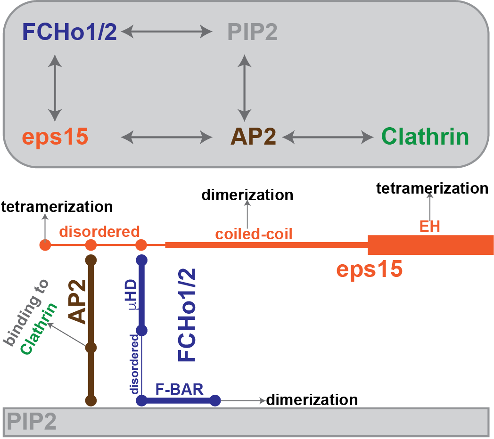

# A cross-link model for the initialization of clathrin assembly on the membrane

**Molecular type:**

* FCHo1/2

molecular informations are stored in f.mol

interactions:

	1. F-BAR binding to PIP2: kD: 0.7 uM
	2. F-BAR dimerization: kD: 2.5 uM

* PIP2

implicit lipid; molecular informations are in p.mol

* eps15

molecular informations are in e.mol

interactions:

	1. 3DPF binding to FCHo1/2(uHD): kD: 2.7 uM
	2. 1DPF to AP2: kD: 200 uM (?)
	3. CC dimer: 0.127 uM (60%)
	4. EH-unstructured tetramer: ? uM (40%)

* ap2

molecular informations are in ap2.mol

* clathrin

molecular informations are in clat.mol